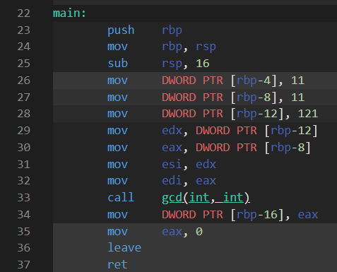

# 函数

理念性规则概览：

- [函数](#函数)
  - [4.1 函数定义](#41-函数定义)
    - [好名字](#好名字)
    - [F.4 如果函数有可能需要在编译期求值，就把它声明为 constexpr](#f4-如果函数有可能需要在编译期求值就把它声明为-constexpr)
    - [F.6 如果你的函数必定不抛出异常，就把它声明为 noexcept](#f6-如果你的函数必定不抛出异常就把它声明为-noexcept)
    - [F.8 优先使用纯函数](#f8-优先使用纯函数)
  - [4.2 参数传递：入与出](#42-参数传递入与出)
    - [F.15 优先采用简单而约定俗成的信息传递方式](#f15-优先采用简单而约定俗成的信息传递方式)
    - [F.16 对于 "入"参，拷贝开销低的类型按值传递，其他类型则以 const 引用来传递](#f16-对于-入参拷贝开销低的类型按值传递其他类型则以-const-引用来传递)
    - [F.19 对于“转发”参数，要用 Tp\&\& 来传递，并且只 std::forward 该参数](#f19-对于转发参数要用-tp-来传递并且只-stdforward-该参数)
    - [F.17 对于“入-出”参数，使用非 const 的引用来传递](#f17-对于入-出参数使用非-const-的引用来传递)
    - [F.20 对于“出”的输出值，优先使用返回值而非输出参数](#f20-对于出的输出值优先使用返回值而非输出参数)
    - [F.21 要返回多个“出”值，优先考虑返回结构体或者多元组](#f21-要返回多个出值优先考虑返回结构体或者多元组)
  - [4.3 参数传递：所有权语义](#43-参数传递所有权语义)
    - [谁是所有者？](#谁是所有者)
  - [4.4 值返回语义](#44-值返回语义)
    - [F.42 返回 T\* （仅仅）用于表示位置](#f42-返回-t-仅仅用于表示位置)
    - [F.44 当不希望发生拷贝，也不需要表达“没有返回对象”时，应返回 T\&](#f44-当不希望发生拷贝也不需要表达没有返回对象时应返回-t)
      - [局部对象的引用](#局部对象的引用)
    - [F.45 不要返回 T\&\&](#f45-不要返回-t)
    - [F.48 不要返回 std::move(本地变量)](#f48-不要返回-stdmove本地变量)
      - [T\&\&](#t)
      - [std::move(本地变量)](#stdmove本地变量)
    - [F.46 main() 的返回类型是 int](#f46-main-的返回类型是-int)

## 4.1 函数定义

- *好软件的重要原则是好名字*。

这一原则经常被忽视，但对函数而言它尤其适用。

### 好名字

C++ Core Guidelines 用了前三条规则专门讨论好的名字：“F.1：将有意义的操作 ‘打包’ 成精心命名的函数” “F.2：一个函数应该执行单一的逻辑操作” “F.3：使函数保持简短”。

让我从一则轶事开始。几年前，一位软件开发者问我：“我应该如何称呼我的函数？”我告诉他给函数起一个如 verbObject（动词加对象）这样的名字。如果是成员函数，可能用 verb 就可以了，因为该函数已经对一个对象执行了操作。动词代表了对象执行的操作。那位软件开发者反驳这是不可能的；该函数必须被称为 getTimeAndAddToPhonebook 或 processData，因为这些函数执行不止一项工作（单一责任原则）。

- *当你无法为函数找到一个有意义的名称（F.1）时，这充分说明你的函数执行不止一项逻辑操作（F.2），而且你的函数并不简短（F.3）*。

如果一个函数放不进一屏，那就是太长了。一屏意味着大约 60 行，每行 140 个字符，但你的衡量标准可能有所不同。这时，你就应该识别出函数的操作，并将这些操作打包成精心命名的函数。

```cpp
void read_and_print(){      //不好
    int x;
    std::cin >> x;
    //检查错误
    std::cout << x << '\n';
}
```

由于许多原因，函数 read_and_print 不好。该函数与特定的输入和输出捆绑在一起，不能在不同的上下文中使用。将该函数重构为两个函数，可以解决这些问题，使其更易于测试和维护。

```cpp
int read(std::istream&is){ //更好
    int x;
    is >> x;
    return x;
}

void print(std::ostream&os,int x){
    os << x << '\n';
}
```

> 这里写个使用示例吧：

```cpp
#include<iostream>
#include<sstream>

int read(std::istream&is){ //更好
    int x;
    is >> x;
    return x;
}

void print(std::ostream&os,int x){
    os << x << ' ';
}

int main(){
    std::stringstream s{"10 "};
    auto result = read(s);          //从 stringstream 中读取
    print(std::cout, result);       //输出到标准输出中

    std::cout << s.str() << '\n';   //打印 stringstream 中的内容

    print(s,6);                     //输出到 stringstream 中。
    print(s,7);                     //输出到 stringstream 中。
    print(s,8);                     //输出到 stringstream 中。

    std::cout << s.str() << '\n';   //打印 stringstream 中的内容

    s.seekg(0);                     //需要进行回溯，因为默认读取位置在上一个read到的位置
    auto result2 = read(s);
    std::cout << result2 << '\n';   //从 stringstream 中读取
}
```

[运行结果](https://godbolt.org/z/45z4Kj5rM)：

```text
10 10 
6 7 8 
6
```

### F.4 如果函数有可能需要在编译期求值，就把它声明为 constexpr

constexpr 函数是可能在编译期运行的函数。当你在常量表达式中调用 constexpr 函数时，或者当你要用一个 constexpr 变量来获取 constexpr 函数的结果时，它会在编译期运行。也可以用只能在运行期求值的参数来调用 constexpr 函数。constexpr 函数是隐含内联的。

编译期求值的 constexpr 的结果通常会被系统标记为只读。性能是 constexpr 函数的一大好处；它的第二大好处是：

**编译期求值的 constexpr 是纯函数，因此 constexpr 函数是线程安全的**。

> 加粗这句话是因为这句话是 **错误** 的。 我们下面把这句话分开来聊：

- “**constexpr 函数是线程安全的**”？

完全错误。

这里会涉及到一个问题：

- C++23 前，标准要求至少存在一组实参值，使得函数的一个调用为核心常量表达式的被求值的子表达式（对于构造函数为足以用于常量初始化器）。**不要求诊断是否违反这点**。
- C++23 起，**标准移除了这一要求**。

```cpp
#include <iostream>
int n = 5;
constexpr int f(int v){//永远不可能编译期求值
    return n *= n, n * v;
}

int main(){
    std::cout << f(1) << '\n';
}//C++23前可能可以通过编译，也可能不行；C++23起能通过编译
```

不过这还是太牵强了，我们可以用一个更简单直接的 demo 展示：

```cpp
constexpr void f(int& a){
    ++a;
}

int main(){
    int b = 10;
    f(b); //运行期调用，修改b
}
```

> 以上这段代码显然不是线程安全的，各位可以自己[测试](https://godbolt.org/z/co8TdvEos)。**你可能可以看到结果是正确的，但是事实上这没什么价值，某些 CPU 能保证标量类型的读写线程安全**。

---

- “**编译期求值的 constexpr 函数是纯函数**“？

完全错误（C++11 以后）

> C++11 的常量求值中函数只能表现为纯的，一旦有修改操作就导致常量求值失败

```cpp
#include<iostream>

constexpr int f(int &v){
    v +=2;
    return v * v;
}

constexpr std::pair<int,int> call(){
    int v = 1;
    auto r1 = f(v);
    auto r2 = f(v);
    return { r1,r2 };
}

int main(){
    constexpr auto result = call();
    std::cout << result.first << ' ' << result.second << '\n';
}
```

我的函数 f **的确是编译期求值**，没毛病，难不成它是[纯函数](https://en.m.wikipedia.org/wiki/Pure_function)？你要不看看它都做了什么.

> 我们回到前面的性能话题

```cpp
constexpr auto gcd(int a,int b){
    while(b!=0){
        auto t = b;
        b = a % b;
        a = t;
    }
    return a;
}

int main(){
    constexpr int i = gcd(11, 121); //（1）编译期求值

    int a = 11;
    int b = 121;
    int j = gcd(a, b);              //（2）非编译期求值
}
```

> 原书这里是要你看[汇编](https://godbolt.org/z/qjzxxv5oe)的，，唉，其实无所谓，看看吧。友情提示，别开优化，这么点代码，开优化，啥 call 都没有。
> 下面是使用 gcc13.2 生成的 Intel 风格的汇编代码。



（1）所对应汇编指令就是 26行。（2）所对应的汇编指令就是 31~34 行。

调用 `constexpr int i = gcd(11, 121);` 会变成值 11，但调用 `int j = gcd(a, b);` 却会产生一个函数调用。

### F.6 如果你的函数必定不抛出异常，就把它声明为 noexcept

通过将函数声明为 noexcept，你减少了备选控制路径的数量；因此，noexcept 对优化器来说是一个有价值的提示。

- *即使你的函数可以抛出异常，noexcept 往往也合理*。

noexcept 在这种情况下意味着：

- *我不在乎异常。其原因可能是，你无法对异常做出反应*。

这种情况下，系统处理异常的唯一办法是调用 [std::terminate()](https://zh.cppreference.com/w/cpp/error/terminate)。这个 noexcept 声明也为代码的读者提供了有价值的信息。

下面的函数会在内存耗尽时崩溃。

```cpp
std::vector<std::string> collect(std::istream& is)noexcept{
    std::vector<std::string>res;
    for (std::string s; is >> s;) {
        res.push_back(s);
    }
    return res;
}
```

以下类型的函数永远不该抛出异常：析构函数（见第 5 章中 “失败的析构函数” 一节）、swap 函数，移动操作和默认构造函数。

### F.8 优先使用纯函数

- *纯函数是指在给定相同参数时总返回相同结果的函数*。

> 其实还有：该函数没有副作用（局部静态变量、非局部变量、可变引用参数或输入/输出流没有突变）。下面也略微提到了。

函数模板 square 就是纯函数：

```cpp
template<class T>
auto square(T t){
    return t * t;
}
```

而非纯函数是指 random() 或 time() 这样的函数，**它们会在不同的调用中返回不同的结果**。换句话说：

- *与函数体之外的状态交互的函数是不纯的*。

纯函数可以：

- 孤立地侧测试
- 孤立地验证或重构
- [缓存其结果](https://github.com/Mq-b/Loser-HomeWork/blob/main/C%2B%2BCoreGuidelines%E8%A7%A3%E6%9E%90/%E7%AC%AC3%E7%AB%A0-%E6%8E%A5%E5%8F%A3.md#i2-%E9%81%BF%E5%85%8D%E9%9D%9E-const-%E7%9A%84%E5%85%A8%E5%B1%80%E5%8F%98%E9%87%8F)
- 被自动重排或在其他线程上执行

纯函数也被称为数学函数。C++ 中的函数默认情况下不是像纯函数式编程语言 Haskell 中那样的纯函数。 在 C++ 中使用纯函数时要基于程序员的素养。**constexpr 函数在编译期求值时是纯的**。

> 加粗的原因很简单，因为这句话是**错的** 在 [`F.4`](#f4-如果函数有可能需要再编译期求值就把它声明为-constexpr) 已经介绍过了。

模板元编程时一种嵌在命令式语言 C++ 中的纯函数式语言。

第 13 章将简单介绍编译期编程，其中包括模板元编程。

## 4.2 参数传递：入与出

C++ Core Guidelines 有若干条规则表达了在函数中传入和传出参数的各种方式。

### F.15 优先采用简单而约定俗成的信息传递方式

第一条规则展示了大局。首先，它提供了一个概览，介绍了在函数中传入和传出信息的各种方式（见表 4.1）

表 4.1 很简洁：表头表述了数据在拷贝和移动开销方面的特征，而各行则表明了参数传递的方向。

<table align="center" border="0">
<p align="center"><b>表 4.1 普通的参数传递</b></p>
    <tr>
         <td></td>
         <td><b>拷贝开销低或不可能拷贝</b></td>
         <td><b>移动开销低到中，或者未知</b></td>
         <td><b>移动开销高</b></td>
    </tr>
    <tr>
         <td align="center"><b>入</b></td>
         <td rowspan="2" align="center">func(x)</td>
         <td rowspan="2" colspan="2" align="center">func(const X&)</td>
    </tr>
    <tr>
         <td><b>入并保留“拷贝</b>”</td>
    </tr>
    <tr>
     <td><b>入/出</b></td>
     <td colspan="3" align="center">func(X&)</td>
    </tr>
    <tr>
     <td><b>出</b></td>
     <td colspan="2" align="center">X func()</td>
     <td align="center">func(X&)</td>
    </tr>
</table>

- 数据类型

  - **拷贝开销低或不可能拷贝**：`int` 或 `std::unique_ptr`
  - **移动开销低**：`std::vector<T>` 或 `BigPOD`（POD 代表 Old Data “简旧数据”，意为一般的传统数据——没有析构函数、构造函数以及虚成员函数的类）
  - **移动开销未知**：模板
  - **移动开销高**：`BigPOD[]` 或者 `std::array<BigPOD>`
- 参数传递的方向

  - **入**：输入参数
  - **入并保留“拷贝”**：被调用者保留一份数据
  - **入/出**：参数会被修改
  - **出**：输出参数

对几个 int 大小的数据的操作是低开销的；在不进行内存分配的前提下，1000 字节左右的操作属于中等开销。

这些普通的参数传递规则则应当是你的首选。不过，也有高级的参数传递规则（见表4.2）。实质上，就是加入了“入并移入”的语义。

<table align="center" border="0">
<p align="center"><b>表 4.2 高级的参数传递</b></p>
    <tr>
         <td></td>
         <td><b>拷贝开销低或不可能拷贝</b></td>
         <td><b>移动开销低到中，或者未知</b></td>
         <td><b>移动开销高</b></td>
    </tr>
    <tr>
         <td align="center"><b>入</b></td>
         <td rowspan="2" align="center">func(x)</td>
         <td rowspan="2" colspan="2" align="center">func(const X&)</td>
    </tr>
    <tr>
         <td><b>入并保留“拷贝</b>”</td>
    </tr>
    <tr>
         <td><b>入并移入</b></td>
         <td colspan="3" align="center">func(X&&)</td>
    </tr>
    <tr>
     <td><b>入/出</b></td>
     <td colspan="3" align="center">func(X&)</td>
    </tr>
    <tr>
     <td><b>出</b></td>
     <td colspan="2" align="center">X func()</td>
     <td align="center">func(X&)</td>
    </tr>
</table>

> 这两个表的 “**出**” 用的 `func(X&)` 其实是指代那种老式的写法，传入参数做传出参数，Win32中很常见。
> “**不可能拷贝**” 其实是指：`f(X{})` 这种形式，C++17 起强制的复制消除，不可能再复制。
> “**入并移入**” 就是让你 `f(std::move(...))`。

在 “入并移入” 调用后，参数处在所谓的被移动状态。被移动状态意味着它处于合法但未指定的状态。基本上，你在重新使用被移动的对象前必须对它进行初始化。

其余的参数传递规则为以上这些表格提供了必要的背景信息。

### F.16 对于 "入"参，拷贝开销低的类型按值传递，其他类型则以 const 引用来传递

这条规则执行起来直截了当。默认情况下，输入值可以拷贝就拷贝。如果拷贝开销不低，就通过 const 引用来传入。C++ Core Guidelines 给出了回答以下问题的经验法则：

**哪些对象拷贝开销低？哪些对象拷贝高？**

- *如果 `sizeof(par) <= 2 * sizeof(void*)`，则按值传递参数 par*。
- *如果 `sizeof(par) > 2 * sizeof(void*)`，则按 const 引用 传递参数 par*。

```cpp
void f()(const std::string& s);  // 可以：按 const 的引用传递；
                                 // 总是低开销
                          
void f2(std::string s);          // 差劲：潜在的高昂开销

void f3(int x);                  // 可以：无可匹敌

void f4(const int& x);           // 差劲：在 f4() 里面访问时有额外开销
```

### F.19 对于“转发”参数，要用 Tp&& 来传递，并且只 std::forward 该参数

这条规则代表了一种特殊的输入值。有时你想完美转发参数 par。这意味着你希望保持左值的左值性，以及右值的右值性，这样才能“完美”地转发参数，使它的语义不发生变化。

该转发参数的典型用例是工厂函数，工厂函数通过调用某个用户指定对象的构造函数创造处该对象。你不知道参数是不是右值，也不知道构造函数需要多少参数。

```cpp
#include <string>
#include <utility>

template<typename T,typename ...T1>     //（1）
T create(T1&&...t1){
    return T(std::forward<T1>(t1)...);
}

struct MyType{
    MyType(int, double, bool) {}
};

int main(){
    // 左值
    int five = 5;
    int myFive = create<int>(five);

    // 右值
    int myFive2 = create<int>(5);

    // 无参数
    int myZero = create<int>();

    // 三个参数；（左值，右值，右值）
    MyType myType = create<MyType>(myZero, 5.5, true);
}
```

**形参包的打包和解包**

当省略号在类型参数 T1 的左边时，参数包被打包；当省略号在右边时，参数包被解包。返回语句 `T(std::forwardt1(t1)...)` 中的这种解包实质上意味着表达式 `std::forwardt1(t1)` **被不断重复，直到形参包中的所有参数都被消耗掉，并且会在每一个子表达式之间加一个逗号**。

```cpp
#include <iostream>

template<typename T, typename ...T1>     //（1）
T create(T1&&...t1) {
    return T(std::forward<T1>(t1)...);
}

struct X{
    X(int,double,char){}
};

int main(){
    X resutl = create<X>(1, 1.2, '*');
}
```

以上代码的 `create` 模板，实例化相当于下面这种形式：（也符合前面说的“被不断重复，直到形参包中的所有参数都被消耗掉，并且会在每一个子表达式之间加一个逗号”）

```cpp
template<>
X create<X, int, double, char>(int && __t10, double && __t11, char && __t12)
{
  return X(X(std::forward<int>(__t10), std::forward<double>(__t11), std::forward<char>(__t12)));
}
```

对于好奇的读者 [C++ Insights](https://cppinsights.io/) 可以展示这个过程。

转发与变参模板的结合是 C++ 中典型的创建模式。下面是 [std::make_unique<T>](https://zh.cppreference.com/w/cpp/memory/unique_ptr/make_unique) 的一种可能实现。

```cpp
template<typename T,typename...Args>
std::unique_ptr<T> make_unique(Args&&...args){
    return std::unique_ptr<T>(new T(std::forward<Args>(args)...));
}
```

### F.17 对于“入-出”参数，使用非 const 的引用来传递

这条规则把函数的设计意图传递给了调用方：该函数会修改它的参数。

```cpp
std::vector<int>myVec{1, 2, 3, 4, 5};

void modifyVector(std::vector<int>& vec){
    vec.push_back(6);
    vec.insert(vec.end(), { 7,8,9,10 });
}
```

### F.20 对于“出”的输出值，优先使用返回值而非输出参数

这条规则很简单。

- *用返回值就好，但别用 const，因为它不但没有附加价值，而且会干扰移动语义*。

也许你认为值的复制开销巨大，这**既对也不对**。原因在于编译器会应用 RVO（return value optimization，返回值优化）或 NRVO（named return value optimization，具名返回值优化）。

RVO 意味着编译器可以消除不必要的复制操作。到了 C++17，原本只是可能会做的优化成了一种**保证**。

```cpp
MyType func(){
    return MyType{};        // C++17 中不会拷贝
}
MyType myType = func();     // C++17 中不会拷贝
```

这几行中可能会发生两次不必要的拷贝操作：第一次在返回调用中，第二次在函数调用中。C++17 中则不会有拷贝操作发生。如果这个返回值有名字，我们就称这种优化为 NRVO。你大概也已经猜到了。

```cpp
MyType func(){
    NyType myValue;
    return myValue;         // 允许拷贝一次
}
MyType myType = func();     // 在 C++17 中不会拷贝
```

这里有一个细微的区别：按照 C++17 编译器仍然可以在返回语句中拷贝值 myValue，但在函数调用的地方则不会发生拷贝。

> 这里详细聊一下 复制消除 NRVO RVO 吧：

下列环境下，允许但不要求编译器省略类对象的复制和移动 (C++11 起)构造，即使复制/移动 (C++11 起)构造函数和析构函数拥有可观察的副作用。这些对象将直接构造到它们本来要复制/移动到的存储中。**这是一项优化**：即使进行了优化而不调用复制/移动 (C++11 起)构造函数，它仍然必须存在且可访问（如同完全未发生优化），否则程序非良构

**在对象的初始化中，当源对象是无名临时量且与目标对象具有相同类型（忽略 cv 限定）时。当无名临时量为 return 语句的操作数时，称这种复制消除的变体为 RVO，“返回值优化 (return value optimization)”。**

C++17起 返回值优化是**强制要求的**（也就是不再被当成优化），而不再被当做复制消除。

这就是 RVO 的规则，只要满足，那么在 C++17 就不可能有复制开销。

我们看到先前的代码示例，之所以第一个示例在 C++17 都不会有额外拷贝就是因为它

`return MyType{};` 满足了：**当无名临时量为 return 语句的操作数**。

`MyType myType = func();` 满足了：**在对象的初始化中，当源对象是无名临时量且与目标对象具有相同类型（忽略 cv 限定）时**。

那么第二个示例呢？

`
MyType myValue;
return myValue;
`
显然不满足 `RVO`，但是可以 `NRVO`。

因为 **NRVO** 的存在，不一定会拷贝，只是不保证而已。

**return 语句中，当操作数是拥有自动存储期的非 volatile 对象的名字，该名字不是函数形参或 catch 子句形参，且其具有与函数返回类型相同的类类型（忽略 cv 限定）时。这种复制消除的变体被称为 **NRVO**，“具名返回值优化 (named return value optimization)”。**

函数往往必须返回多于一个值。于是，规则 F.21 来了。

### F.21 要返回多个“出”值，优先考虑返回结构体或者多元组

当你向 std::set 中插入一个值时，成员函数 insert 的重载会返回一个 std::pair，它由两部分组成：一个指向所插入元素的迭代器；还有一个 bool，如果插入成功，它会被设置为 true。C++11 中的 std::tie 和 C++17 中的结构化绑定是将两个值绑定到某变量的两种优雅方式。

```cpp
#include <iostream>
#include <set>
#include <tuple>

int main() {
    std::cout << '\n';

    std::set<int>mySet;

    std::set<int>::iterator iter;
    bool inserted = false;
    std::tie(iter, inserted) = mySet.insert(2011); //（1）
    if (inserted) std::cout << "2011 was inserted successfully\n";

    auto [iter2, inserted2] = mySet.insert(2017);  //（2）
    if (inserted2) std::cout << "2017 was inserted successfully\n";

    std::cout << '\n';
}
```

在（1）处，我们使用 [std::tie](https://zh.cppreference.com/w/cpp/utility/tuple/tie) 将插入操作的返回值解包到 iter 和 inserted 中。而在（2）处，我们使用结构化绑定将插入操作的返回值解包到 iter2 和 inserted2 中。与结构化绑定相比，std::tie 还需要预先声明的变量。[运行结果](https://godbolt.org/z/3GKbGeYsY)：

```text

2011 was inserted successfully
2017 was inserted successfully

```

## 4.3 参数传递：所有权语义

上一节探讨参数的流向：哪些参数是入，哪些参数是入/出或出。但对参数来说，除了流动的方向，还有其他需要考虑的问题。传递参数也事关**所有权语义**。但本节会介绍 5 种典型的参数传递方式：通过拷贝、通过指针、通过引用、通过 std::unique_ptr 和通过 std::shared_ptr 。

只有通过智能指针传参的相关规则是在本节内新出现的。

通过拷贝传参的规则是 [4.2 节“参数传递：入与出”](#42-参数传递入与出)的一部分。而通过指针和引用传参的规则是 [第 3 章](第3章-接口.md)的一部分。

表 4.3 提供了概览。

<p align="center"><b>表 4.3 参数传递的所有权语义</b></p>

<table align="center" border="0">
    <tr>
         <td><b>例子</b></td>
         <td><b>所有权</b></td>
         <td><b>规则</b></td>
    </tr>
    <tr>
         <td>func(value)</td>
         <td>func 是资源所有者</td>
         <td>F.16</td>
    </tr>
    <tr>
         <td>func(pointer*) </td>
         <td>func 借用了资源</td>
         <td>I.11 和 F.7</td>
    </tr>
    <tr>
         <td>func(reference&)</td>
         <td>func 借用了资源</td>
         <td>I.11 和 F.7</td>
    </tr>
    <tr>
         <td>func(<a href="https://zh.cppreference.com/w/cpp/memory/unique_ptr">std::unique_ptr</a>)</td>
         <td>func 是资源的独占所有者</td>
         <td>F.26</td>
    </tr>
    <tr>
         <td>func(<a href="https://zh.cppreference.com/w/cpp/memory/shared_ptr">std::shared_ptr</a>)</td>
         <td>func 是资源的共享所有者</td>
         <td>F.27</td>
    </tr>
</table>

更多细节如下。

- func(value)：函数 func 自己有一份 value 的拷贝并且就是其所有者。func 会自动释放该资源。
- func(pointer*)：func 借用了资源，所以无权删除该资源。func 在每次使用前都必须检查该指针是否为空指针。
- func(reference&)：func 借用了资源。与指针不同，引用的值总是合法的。
- func(std::unique_ptr)：func 是资源的新所有者。func 的调用方显式地把资源的所有权传给了被调用方。func 会自动释放该资源。
- func(std::shared_ptr)：func 是资源的额外所有者。func 会延长资源的生存期。在 func 结束时，它也会结束对资源的所有权。如果 func 是资源的最后一个所有者，那么它的结束会导致资源的释放。

### 谁是所有者？

务必明确表达出所有权。试想一下，你的程序是用传统 C++ 编写的，只能使用原始指针来表达指针、引用、std::unique_ptr 或 std::shared_ptr 这四种传参方式的所有权语义。

- *传统 C++ 的关键问题是，谁是所有者？*

下面的代码说明了我的观点：

```cpp
void func(double* ptr){
  ...
}

double* ptr = new double[5];
func(ptr);
```

关键问题是，谁是资源的所有者？是使用该数组的 func 中的被调用方，还是创建该数组的 func 的调用方？如果 func 是所有者，那么它必须释放该资源。如果不是，则func 不可以释放资源。这种情况不能令人满意。如果 func 不释放资源，可能会发生内存泄露。如果 func 释放了资源，可能会导致未定义行为。

因此，所有权需要记录在文档中。使用现代 C++ 中的类型系统来定义所有权的契约是朝正确方向迈出的一大步，可以消除文档的模糊性。

- *在应用层面使用 [`std::move`](https://zh.cppreference.com/w/cpp/utility/move) 的意图并不在于移动，而是所有权的转移*。

举例来说，若对 std::unique_ptr 应用 std::move，会将内存的所有权转移到另一个 std::unique_ptr。智能指针 uniquePtr1 是原来的所有者，而 uniquePtr2 将成为新的所有者。

```cpp
auto uniquePtr1 = std::make_unique<int>(2011);
std::unique_ptr<int> uniquePtr2{ std::move(uniquePtr1) };
```

下面是所有权在实践中的五种变体：

```cpp
#include <iostream>
#include <memory>
#include <utility>

class MyInt{
public:
    explicit MyInt(int val) :myInt(val) {}
    ~MyInt(){
        std::cout << myInt << '\n';
    }
private:
    int myInt;
};

void funcCopy(MyInt myInt) {}
void funcPtr(MyInt* myInt) {}
void funcRef(MyInt& myInt) {}
void funcUniqPtr(std::unique_ptr<MyInt>myInt) {}
void funcSharedPtr(std::shared_ptr<MyInt>myInt){}

int main(){
    std::cout << '\n';

    std::cout << "=== Begin" << '\n';

    MyInt myInt{ 1998 };
    MyInt* myIntPtr = &myInt;
    MyInt& myIntRef = myInt;
    auto uniqPtr = std::make_unique<MyInt>(2011);
    auto sharedPtr = std::make_shared<MyInt>(2014);

    funcCopy(myInt);
    funcPtr(myIntPtr);
    funcRef(myIntRef);
    funcUniqPtr(std::move(uniqPtr));
    funcSharedPtr(sharedPtr);

    std::cout << "=== End" << '\n';
}
```

[运行结果](https://godbolt.org/z/z8Tn197Ph)：

```text

=== Begin
1998
2011
=== End
2014
1998

```

运行结果显示，有两个析构函数在 main 函数结束之前被调用，还有两个析构函数在 main 函数结束的地方被调用。

在 main 函数结束之前析构的是 被**拷贝**到函数中（`funcCopy(myInt)`），以及被**移动**到函数中 （`funcUniqPtr(std::move(uniqPtr))`）。

1. 拷贝拷贝了一份新的 MyInt 到函数 func 中，func 结束的时候，自然进行析构，打印 `1998`。

2. 移动转移了智能指针资源的所有权，所以在 func 结束的时候，`RAII` 释放了内存，打印 `2011`。

3. `shared_ptr` 对象的资源并没有转移，它是共享的，有两个对象共享资源，分别是 main 函数局部的，以及 func 函数中的，所以当 func 结束的时候，只是引用计数减一，不会释放资源。只能等到 main 函数也结束的时候才会析构，释放内存，打印 `2014` 。

4. `MyInt myInt` 析构，打印 `1998`。其实你可以注意到，打印了两次 `1998`，因为第一次析构的是复制到函数中的。

## 4.4 值返回语义

本节中的 7 条规则与前面提到的规则 “F.20：对于‘出’的输出值，优先使用返回值而非输出参数”相一致。这一节的规则还与一些特殊用例和不建议的做法相关。

### F.42 返回 T* （仅仅）用于表示位置

- *指针仅用于表示位置*

这正是 find 的作用。

```cpp
Node * find(Node* t, const string& s){
    if(!t || t->name == s)return t;
    if((auto p = find(t->left,s)))return p;
    if((auto p = find(t->right,s)))return p;
    return nullptr;
}
```

这里指针表示名字与 s 相匹配的 Node 的位置。

### F.44 当不希望发生拷贝，也不需要表达“没有返回对象”时，应返回 T&

当不存在“没有返回对象” 这种可能性的时候就可以返回引用而非指针了。

有时你**想进行链式操作**，但不想为不必要的临时对象进行拷贝和析构。典型的用例是输入和输出流或赋值运算符（“F.47：从赋值运算符返回 T&”）。在下面的代码片段中，通过 **T&** 返回和通过 **T** 返回有什么微秒的区别？

```cpp
A& operator = (const A& rhs) { ... };
A operator = (const A& rhs) { ... };

A a1, a2, a3;
a1 = a2 = a3;
```

返回拷贝（A）的拷贝赋值运算符会触发两个额外的 A 类型临时对象的创建。

#### 局部对象的引用

返回局部对象的引用（指针）是[未定义行为](https://zh.cppreference.com/w/cpp/language/ub)。

- *未定义行为本质上意味着，不要假想程序的行为*。

先修复未定义行为。程序 `lambdaFuncionCapture.cpp` 返回了局部对象的引用。

```cpp
#include <functional>
#include <iostream>
#include <string>

auto makeLambda(){
    const std::string val = "on stack created";
    return [&val] {return val; };   //（2）
}

int main(){
    auto bad = makeLambda();        //（1）
    std::cout << bad();             //（3）
}
```

main 函数调用函数 makeLambda()（1）。该函数返回一个 Lambda 表达式，它具有对局部变量 val（2）的引用。

调用 bad()（3）导致了未定义行为，因为 Lambda 表达式使用了局部变量 val 的引用。由于它是局部变量，它的生存期随着 makeLambda() 的作用域结束而结束。

执行该程序时会得到无法预知的结果。有时我得到整个字符串，有时得到字符串的一部分，有时只得到 0。

> 且可能随着 C++ 标准的不同，优化的等级等，而[变化](https://godbolt.org/)。纠结这个结果并没有多少价值，**未定义行为本质上意味着，不要假想程序的行为**。

### F.45 不要返回 T&&

以及

### F.48 不要返回 std::move(本地变量)

两条规则都非常严格。

#### T&&

不应当以 T&& 作为返回类型。下面的小例子展示了这个问题。

```cpp
int&& returnRvalueReference(){
    return int{};
}

int main(){
    auto myInt = returnRvalueReference();
}
```

在编译时，GCC 编译器会立即抱怨对临时对象的引用。准确地说，临时对象的生存期随着整个表达式 `auto myInt = returnRvalueReference();` 的结束而结束。

> **在函数调用中绑定到函数形参的临时量，存在到含这次函数调用的全表达式结尾为止：如果函数返回一个生命长于全表达式的引用，那么它会成为悬垂引用。** 

```text
<source>: In function 'int&& returnRvalueReference()':
<source>:2:16: warning: returning reference to temporary [-Wreturn-local-addr]
    2 |     return int{};
      |   
```

#### std::move(本地变量)

由于 RVO 和 NRVO 的拷贝消除，return std::move(本地变量)的使用不是优化而是劣化。劣化意味着**程序可能会变得更慢**。

> std::move(本地变量)的确毫无意义，但是 `return std::move(expr)` 不是，可以看之前的[文章](https://zhuanlan.zhihu.com/p/654113232)。

### F.46 main() 的返回类型是 int

依照 C++ 标准，main 函数体有两种变体：

```cpp
int main() { ... }

int main(int argc, char** argv){ ... }
```

第二个版本等效于 `int main(int argc, char* argv[]){ ... }`。

main 函数并不需要返回语句。如果控制流抵达 main 函数的末尾而没有碰到一条返回语句，其效果相当于 `return 0;`。return 0 意味着程序成功执行。

> 这里最前面说的 **依照 C++ 标准**。
> 我们都知道 main 函数的形式远不止这些，但那些都是编译器的扩展，我们用 msvc 举几个例子。
> 
```cpp
int wmain();
int wmain(int argc, wchar_t *argv[]);
```

参见 [msvc 文档](https://learn.microsoft.com/zh-cn/cpp/cpp/main-function-command-line-args?view=msvc-170)。
