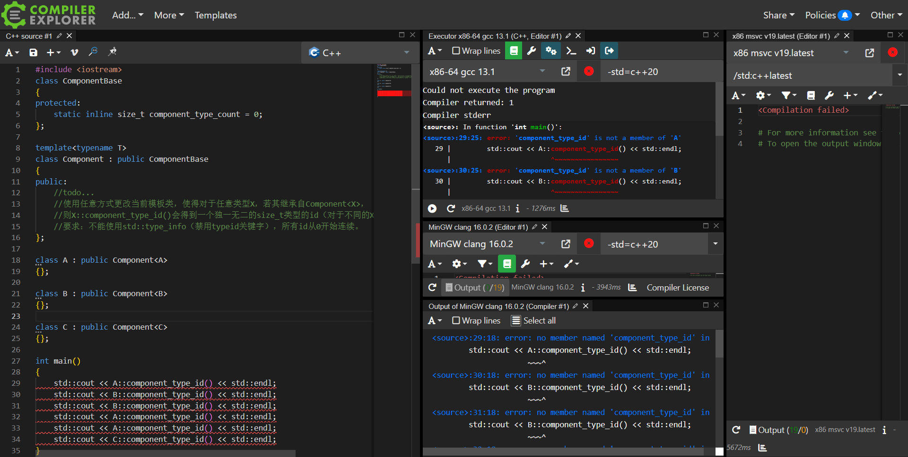

<div align=center>
<a href = "https://www.bilibili.com/video/BV1Zj411r7eP/?spm_id_from=333.999.0.0"></a>
<a target="_blank" href = "https://qm.qq.com/cgi-bin/qm/qr?k=X-ouAYdQzPDQGUR7R-vECHDpXb7Uihdm&jump_from=webapi&authKey=5XYoNIfb913mo5Ff3P1nOhVy1pJgCM4Q6wAykQ+rpiDQSRu+tCXMN6yGOkjxIIrl"></a>
<a href="https://www.zhihu.com/people/o4ze4r"></a>
<a href="https://www.youtube.com/channel/UCey35Do4RGewqr-6EiaCJrg"></a>

<br>

<a href = "https://learn.microsoft.com/zh-cn/cpp/cpp/welcome-back-to-cpp-modern-cpp?view=msvc-170">
</a>

<a href = "https://zh.cppreference.com/w/cpp/compiler_support/20">
</a>

<a href = "https://zh.cppreference.com/w/cpp/compiler_support/23">
</a>

<a href= "https://gcc.gnu.org/onlinedocs/gcc-12.2.0/gcc/">
</a>
<a href = "https://learn.microsoft.com/zh-cn/cpp/cpp/?view=msvc-170"></a>


</div>

<div align=center>

<a href="https://zh.cppreference.com/w/cpp">
</a>

</div>

<details> <summary><h2>目录</h2></summary>


<br>

- [Loser-HomeWork](#loser-homework)
  - [前言](#前言)
  - [`01`实现管道运算符](#01实现管道运算符)
    - [运行结果](#运行结果)
    - [群友提交](#群友提交)
    - [标准答案](#标准答案)
  - [`02`实现自定义字面量`_f`](#02实现自定义字面量_f)
    - [运行结果:](#运行结果-1)
    - [群友提交](#群友提交-1)
    - [标准答案](#标准答案-1)
  - [`03`实现`print`以及特化`std::formatter`](#03实现print以及特化stdformatter)
    - [运行结果](#运行结果-2)
    - [群友提交](#群友提交-2)
    - [标准答案](#标准答案-2)
  - [`04`给定模板类修改，让其对每一个不同类型实例化有不同`ID`](#04给定模板类修改让其对每一个不同类型实例化有不同id)
    - [运行结果](#运行结果-3)
    - [群友提交](#群友提交-3)
    - [标准答案](#标准答案-3)
  - [`05`实现`scope_guard`类型](#05实现scope_guard类型)
    - [运行结果](#运行结果-4)
    - [群友提交](#群友提交-4)
    - [标准答案](#标准答案-4)
  - [`06`解释`std::atomic`初始化](#06解释stdatomic初始化)
    - [群友提交](#群友提交-5)
    - [标准答案](#标准答案-5)
  - [`07` **`throw`** `new MyException`](#07-throw-new-myexception)
    - [运行结果](#运行结果-5)
    - [群友提交](#群友提交-6)
    - [标准答案](#标准答案-6)
  - [`08`定义`array`推导指引](#08定义array推导指引)
    - [运行结果：](#运行结果-6)
    - [群友提交](#群友提交-7)
    - [标准答案](#标准答案-7)
  
</details>

# Loser-HomeWork

## 前言

**卢瑟们的作业展示。**

[提交`pr`](提交pr教程.md)不应当更改当前`README`，请将作业提交到`src\群友提交`中，比如你要提交第一个作业：

你应当在`src\群友提交\第一题`中创建一个自己的`.md`或`.cpp`文件，**文件名以自己交流群ID命名（或github都可，方便找到本人即可）**。

答题的**一般要求**如下（题目额外要求也自行注意看）：

1. 不更改`main`函数，不得使其不运行（意思别捞偏门）。
2. 自行添加代码，在满足第一点的要求下，要能成功编译运行并与 **给出运行结果一致**。

## `01`实现管道运算符
日期：**`2023/7/21`** 出题人：**`mq白`**

给出代码：
```cpp
int main(){
    std::vector v{1, 2, 3};
    std::function f {[](const int& i) {std::cout << i << ' '; } };
    auto f2 = [](int& i) {i *= i; };
    v | f2 | f;
}
```
### 运行结果
```
1 4 9
```

- 难度：**一星**

### 群友提交

答题者：[**`andyli`**](src/群友提交/第一题/andyli.cpp)
```cpp
#include <algorithm>
#include <vector>
#include <functional>
#include <iostream>

template <typename R, typename F>
auto operator|(R&& r, F&& f) {
    for (auto&& x: r)
        f(x);
    return r;
}
int main() {
    std::vector v{1, 2, 3};
    std::function f{[](const int& i) { std::cout << i << ' '; }};
    auto f2 = [](int& i) { i *= i; };
    v | f2 | f;
}
```
>很常规，没啥问题。

答题者：[**`mq松鼠`**](src/群友提交/第一题/mq松鼠.cpp)
```cpp
#include<iostream>
#include <vector>
#include <functional>

auto operator | (std::vector<int>&& v,std::function<void(const int&)> f){
    for(auto&i:v){
        f(i);
    }
    return v;
}
auto operator | (std::vector<int>& v,std::function<void(int&)> f){
    for(auto&i:v){
        f(i);
    }
    return v;
}
int main(){
    std::vector v{1, 2, 3};
    std::function f {[](const int& i) {std::cout << i << '\n'; } };
    auto f2 = [](int& i) {i *= i; };
    v | f2 | f;
}
```
>评价：闲的没事多写个重载，裱起来。

<br>

### 标准答案

```cpp
template<typename U, typename F>
    requires std::regular_invocable<F, U&>//可加可不加，不会就不加
std::vector<U>& operator|(std::vector<U>& v1, F f) {
    for (auto& i : v1) {
        f(i);
    }
    return v1;
}
```
**不使用模板**：
```cpp
std::vector<int>& operator|(std::vector<int>& v1, const std::function<void(int&)>& f) {
    for (auto& i : v1) {
        f(i);
    }
    return v1;
}
```
不使用范围`for`，使用`C++20`简写函数模板：
```cpp
std::vector<int>& operator|(auto& v1, const auto& f) {
    std::ranges::for_each(v1, f);
    return v1;
}
```
**各种范式无非就是这些改来改去了，没必要再写。**

---

<br>

## `02`实现自定义字面量`_f`
日期：**`2023/7/22`** 出题人：**`mq白`**

给出代码：
```cpp
int main(){
    std::cout << "乐 :{} *\n"_f(5);
    std::cout << "乐 :{0} {0} *\n"_f(5);
    std::cout << "乐 :{:b} *\n"_f(0b01010101);
    std::cout << "{:*<10}"_f("卢瑟");
    std::cout << '\n';
    int n{};
    std::cin >> n;
    std::cout << "π：{:.{}f}\n"_f(std::numbers::pi_v<double>, n);
}
```
### 运行结果:
```
乐 :5 *
乐 :5 5 *
乐 :1010101 *
卢瑟******
6
π：3.141593
```

- 难度:**二星**

`6`为输入，决定`π`的小数点后的位数，可自行输入更大或更小数字。
提示：`C++11用户定义字面量`，`C++20format库`。
难度：**二星**

### 群友提交

答题者：[**`andyli`**](/src/群友提交/第二题/andyli.cpp)

```cpp
#include <format>
#include <iostream>
#include <string_view>
#include <string>

namespace impl {
    struct Helper {
        const std::string_view s;
        Helper(const char* s, std::size_t len): s(s, len) {}
        template <typename... Args>
        std::string operator()(Args&&... args) const {
            return std::vformat(s, std::make_format_args(std::forward<Args>(args)...));
        }
    };
} // namespace impl
impl::Helper operator""_f(const char* s, std::size_t len) noexcept {
    return {s, len};
}

int main() {
    std::cout << "乐 :{} *\n"_f(5);
    std::cout << "乐 :{0} {0} *\n"_f(5);
    std::cout << "乐 :{:b} *\n"_f(0b01010101);
    std::cout << "{:*<10}"_f("卢瑟");
    std::cout << '\n';
    int n{};
    std::cin >> n;
    std::cout << "π：{:.{}f}\n"_f(std::numbers::pi_v<double>, n);
}
```

<br>

### 标准答案

```cpp
constexpr auto operator""_f(const char* fmt, size_t) {
    return[=]<typename... T>(T&&... Args) { return std::vformat(fmt, std::make_format_args(std::forward<T>(Args)...)); };
}
```

---

<br>

## `03`实现`print`以及特化`std::formatter`
日期：**`2023/7/24`** 出题人：**`mq白`**

实现一个`print`，如果你做了上一个作业，我相信这很简单。
要求调用形式为: 
```cpp
print(格式字符串，任意类型和个数的符合格式字符串要求的参数)
```
```cpp
struct Frac {
   int a, b;
};
```
给出自定义类型`Frace`，要求支持
```cpp
Frac f{ 1,10 };
print("{}", f);// 结果为1/10
```

### 运行结果

    1/10

- 难度:**三星**

禁止面相结果编程，使用宏等等方式，最多`B`（指评价），本作业主要考察和学习`format`库罢了。

提示: **`std::formatter`**
>提交代码最好是网上编译了三个平台的截图，如：


### 群友提交

<br>

### 标准答案

```cpp
template<>
struct std::formatter<Frac>:std::formatter<char>{
    auto format(const auto& frac, auto& ctx)const{//const修饰是必须的
        return std::format_to(ctx.out(), "{}/{}", frac.a, frac.b);
    }
};
void print(std::string_view fmt,auto&&...args){
    std::cout << std::vformat(fmt, std::make_format_args(std::forward<decltype(args)>(args)...));
}
```

我们只是非常简单的支持了**题目要求**的形式，给`std::formatter`进行特化，如果要支持比如那些`{:6}`之类的格式化的话，显然不行，这涉及到更多的操作。
简单的特化以及[`std::formatter`](https://zh.cppreference.com/w/cpp/utility/format/formatter)支持的形式可以参见[**文档**](https://zh.cppreference.com/w/cpp/utility/format/formatter)。
一些复杂的特化，`up`之前也有写过，在[**`Cookbook`**](https://github.com/Mq-b/Cpp20-STL-Cookbook-src#76%E4%BD%BF%E7%94%A8%E6%A0%BC%E5%BC%8F%E5%BA%93%E6%A0%BC%E5%BC%8F%E5%8C%96%E6%96%87%E6%9C%AC)中；里面有对[`std::ranges::range`](https://zh.cppreference.com/w/cpp/ranges/range)，和[`std::tuple`](https://zh.cppreference.com/w/cpp/utility/tuple)的特化，支持所有形式。

---

<br>

## `04`给定模板类修改，让其对每一个不同类型实例化有不同`ID`
日期：**`2023/7/25`** 出题人：**`Maxy`**
```cpp
#include<iostream>
class ComponentBase{
protected:
    static inline size_t component_type_count = 0;
};
template<typename T>
class Component : public ComponentBase{
public:
    //todo...
    //使用任意方式更改当前模板类，使得对于任意类型X，若其继承自Component

    //则X::component_type_id()会得到一个独一无二的size_t类型的id（对于不同的X类型返回的值应不同）
    //要求：不能使用std::type_info（禁用typeid关键字），所有id从0开始连续。
};
class A : public Component<A>
{};
class B : public Component<B>
{};
class C : public Component<C>
{};
int main()
{
    std::cout << A::component_type_id() << std::endl;
    std::cout << B::component_type_id() << std::endl;
    std::cout << B::component_type_id() << std::endl;
    std::cout << A::component_type_id() << std::endl;
    std::cout << A::component_type_id() << std::endl;
    std::cout << C::component_type_id() << std::endl;
}
```

### 运行结果


    0
    1
    1
    0
    0
    2

- 难度:**一星**

>提交应当给出多平台测试结果，如图：



### 群友提交

<br>

### 标准答案

```cpp
template<typename T>
class Component : public ComponentBase{
public:
    static size_t component_type_id(){
        static size_t ID = component_type_count++;
        return ID;
    }
};
```

分析：

我们需要实现`Component`的静态成员函数`component_type_id`。这是从给出代码得知的：
```cpp
class A : public Component<A>
{};
A::component_type_id()
```
题目要求是每一个自定义类类型（假设是X）继承`Component<X>`，调用`component_type_id()`返回的是自己独一无二的ID。其他的类型同理。

解决题目之前我们需要强调一个知识点：
>C++的模板不是具体类型，实例化之后才是，模板类的静态成员或静态成员函数也**不属于模板**我们可以用一段代码来展示结论：

```cpp
#include <iostream>

template<typename T>
struct Test{
	inline static int n = 10;
};

int main(){
	Test<int>::n = 1;
	std::cout << Test<void>::n << '\n';//10
	std::cout << Test<int>::n << '\n';//1
}
```

这段代码很轻易的就展示了**静态数据成员属于模板实例化后的具体类型**
`Test<void>::n` 和 `Test<int>::n`不是相同的n，并且`Test<void>`和`Test<int>`也不是一种类型。

（静态成员函数同理）

所以我们的解法利用的是：不同的类型实例化`Component`类模板，也是不同的静态成员函数，静态成员函数里面的局部静态数据成员在第一次调用的时候才会初始化，后面就不会。

---

<br>

## `05`实现`scope_guard`类型
日期：**`2023/7/29`** 出题人：**`mq白`**

要求实现 **`scope_guard`** 类型 （ 即支恃传入任意可调用类型 , 析构的时候同时调用 ）。
```cpp
#include <cstdio>
#include <iostream>
#include <functional>

struct X {
    X() { puts("X()"); }
    X(const X&) { puts("X(const X&)"); }
    X(X&&) noexcept { puts("X(X&&)"); }
    ~X() { puts("~X()"); }
};

int main() {
    {
        auto x = new X{};
        auto guard = scope_guard([&] {
            delete x;
            x = nullptr;
        });
    }
    puts("----------");
    {
        struct Test {
            void operator()(X*& x) {
                delete x;
                x = nullptr;
            }
        };
        auto x = new X{};
        Test t;
        auto guard = scope_guard(t, x);
    }
    puts("----------");
    {
        struct Test {
            void f(X*& x) {
                delete x;
                x = nullptr;
            }
        };
        auto x = new X{};
        Test t;
        auto guard = scope_guard{&Test::f, &t, x}; 
    }
}
```

### 运行结果

    X()
    ~X()
    ----------
    X()
    ~X()
    ----------
    X()
    ~X()

- 难度:**四星**（完全满足要求的情况下）

### 群友提交

<br>

### 标准答案

**使用类型擦除**：
```cpp
struct scope_guard {
    std::function<void()>f;
    template<typename Func, typename...Args>requires std::invocable<Func, Args...>
    scope_guard(Func&& func, Args&&...args) :f{ [func = std::forward<Func>(func), ...args = std::forward<Args>(args)]() mutable {
            std::invoke(std::forward<std::decay_t<Func>>(func), std::forward<Args>(args)...);
        } }{}
    ~scope_guard() { f(); }
    scope_guard(const scope_guard&) = delete;
    scope_guard& operator=(const scope_guard&) = delete;
};
```
>其实大家也可以考虑直接用std::bind，我这样用lambda有点复杂的过分了。

第一次构造是外面的默认构造；

第二次构造是初始化 lambda 捕获时复制构造；

第三次构造是从 lambda 初始化 `std::function` 时的移动构造；

第四次构造是调用f的复制构造。

第一个析构是 lambda 表达式的结果对象，里面因为 `decay-copy` 存了个 `X`。
`invoke` 的东西是 `std::function` 初始化时，通过移动构造创建的副本。

<br>

**使用 `std::tuple`+`std::apply`**：
```cpp
template<typename F, typename...Args>
    requires requires(F f, Args...args) { std::invoke(f, args...); }
struct scope_guard {
    F f;
    std::tuple<Args...>values;

    template<typename Fn, typename...Ts>
    scope_guard(Fn&& func, Ts&&...args) :f{ std::forward<Fn>(func) }, values{ std::forward<Ts>(args)... } {}
    ~scope_guard() {
        std::apply(f, values);
    }
    scope_guard(const scope_guard&) = delete;
};

template<typename F, typename...Args>//推导指引非常重要
scope_guard(F&&, Args&&...) -> scope_guard<std::decay_t<F>, std::decay_t<Args>...>;
```

---

<br>

## `06`解释`std::atomic`初始化
日期：**`2023/8/2`** 出题人：**`mq白`**

```cpp
#include <iostream>
#include <atomic>
int main() {
    std::atomic<int> n = 6;
    std::cout << n << '\n';
}
```

解释，为什么以上[代码](https://godbolt.org/z/sfEzP8136)在 `C++17` 后可以通过编译， `C++17` 前不行？


- 难度:**三星**

### 群友提交

<br>

### 标准答案

`std::atomic<int> n = 6;`中，由于`6`和`std::atomic<int>`不是同一类型（但是这里其实有一个用户定义转换序列，你可以简单的认为`6`可以隐式转换）。

即调用转换构造函数：
```cpp
constexpr atomic( T desired ) noexcept;
```
>转换构造函数也会作为用户定义的转换序列中的一部分

`6`会调用转换构造函数，构造出一个临时的atomic对象用来**直接初始化n**，即
```cpp
std::atomic<int> n(std::atomic<int>(6))
```
在 **`C++17`之前** 的版本，理所应当应该查找检测复制/移动 构造函数，满足要求才可以通过编译。但是：
```cpp
atomic( const atomic& ) = delete;
```
实际上atomic的复制构造被删除（同时移动构造也被抑制生成了）。所以自然而然的不允许。

`C++17`的改动是：**复制消除变为强制要求**。
纯右值表达式作为构造对象的参数，不会再调用移动构造，也不会去检测，而是原位构造。
>说句题外话，C++17后纯右值不可能再调用移动构造。没有移动构造或者复制构造不影响使用同类型纯右值初始化对象，如`X x{X{}}`，即使移动/复制构造函数**都被delete**，也无所谓，[`code`](https://godbolt.org/z/Kdncxcc3o)。

---

<br>

## `07` **`throw`** `new MyException`

日期：**`2023/8/6`** 出题人：**`mq白`**

给出代码:
```cpp
struct MyException :std::exception {
	const char* data{};
	MyException(const char* s) :data(s) { puts("MyException()"); }
	~MyException() { puts("~MyException()"); }
	const char* what()const noexcept { return data; }
};
void f2() {
	throw new MyException("new Exception异常....");
}
int main(){
    f2();
}
```
>灵感来源自 **`java`** 人写 **`C++`**

在`main`函数中自行修改代码，接取`f2()`函数抛出的异常（`try catch`）。

### 运行结果

    MyException()
    new Exception异常....
    ~MyException()

- 难度:**一星**

>某些IDE或者平台可能会将打印的异常信息标为红色放到第一行，即
>new Exception异常.... 这句话也可能在第一行（一般终端运行不会，默认vs也无此功能）

### 群友提交

<br>

### 标准答案

```cpp
int main() {
    try{
        f2();
    }
    catch (std::exception* e){
        std::cerr << std::unique_ptr<std::exception>(e)->what() << '\n';
    }
}
```

实际上本题是用来讽刺将`java`的写法带入到其他语言中，也就是很经典的：
**`java`人写什么都是`java`**。
只是看我们这道题，实际上你非要说`new`有什么不好，倒也没什么非常不行的地方，只是，没有理由自己多写一个`delete`表达式（或者包个智能指针）。
> 我希望不要有人开始幻想：`throw new MyException("new Exception异常....")`因为是`throw`一个指针类型，所以按指针传递，效率更高。不要让我看到这种逆天想法。如果你想到这一点，那不妨思考一下，构造临时对象的开销，以及使用`new`表达式？ 说实话挺无聊的问题，只是防止有人想到这些点，以及抬杠罢了。


---

<br>

## `08`定义`array`推导指引
日期：**`2023/8/12`** 出题人：**`mq白`**

给出代码:
```cpp
template<class Ty,size_t size>
struct array {
    Ty* begin() { return arr; };
    Ty* end() { return arr + size; };
    Ty arr[size];
};
int main() {
    ::array arr{1, 2, 3, 4, 5};
    for (const auto& i : arr) {
        std::cout << i << ' ';
    }
}
```

要求**自定义推导指引**，不更改已给出代码，使得代码成功编译并满足运行结果。

> 提示：可参考[`std::array`](https://zh.cppreference.com/w/cpp/container/array)

### 运行结果：

    1 2 3 4 5 

- 难度:**三星**

### 群友提交

<br>

### 标准答案

```cpp
template<class Ty, class...Args>
    requires (std::same_as<Ty, Args>&&...)//不会这个C++20约束以及里面折叠表达的用法也可以不用
array(Ty, Args...) -> array<Ty, 1 + sizeof...(Args)>;
```
 本题的目的如你所见主要考察的是 **`C++17`用户定义类模板推导指引**。但是我更多的其实我想表达的是：
 定义类模板推导指引和构造函数没什么直接的关联；如题目所示，我们的`array`是一个聚合类型，压根没有显式的用户定义构造函数，**没有显示的构造函数并不影响我们使用自定义的用户推导指引**。
 
 >如此强调只是因为大部分人对此有很多错误认知
 
 推导指引实际上是按照你构造器传入的东西，来进行的这种推导，我觉得我视频里说的已经很清楚了。
 

---

<br>
