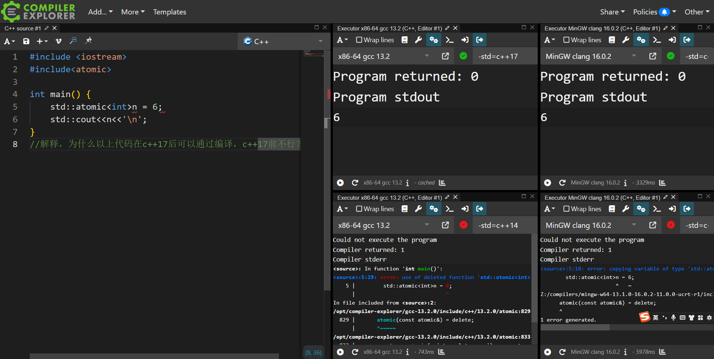

<div align=center>
<a href = "https://www.bilibili.com/video/BV1Zj411r7eP/?spm_id_from=333.999.0.0"></a>
<a target="_blank" href = "https://qm.qq.com/cgi-bin/qm/qr?k=X-ouAYdQzPDQGUR7R-vECHDpXb7Uihdm&jump_from=webapi&authKey=5XYoNIfb913mo5Ff3P1nOhVy1pJgCM4Q6wAykQ+rpiDQSRu+tCXMN6yGOkjxIIrl"></a>
<a href="https://www.zhihu.com/people/o4ze4r"></a>
<a href="https://www.youtube.com/channel/UCey35Do4RGewqr-6EiaCJrg"></a>
<br>
<a href = "https://learn.microsoft.com/zh-cn/cpp/cpp/welcome-back-to-cpp-modern-cpp?view=msvc-170">
</a>
<a href = "https://zh.cppreference.com/w/cpp/compiler_support/20">
</a>
<a href = "https://zh.cppreference.com/w/cpp/compiler_support/23">
</a>
<a href= "https://gcc.gnu.org/onlinedocs/gcc-12.2.0/gcc/">
</a>
<a href = "https://learn.microsoft.com/zh-cn/cpp/cpp/?view=msvc-170"></a>
<br>
<a href="https://zh.cppreference.com/w/cpp">
</a>

</div>

<details>
<summary><h2>目录</h2></summary>

- [Loser-HomeWork](#loser-homework)
  - [前言](#前言)
  - [`01` 实现管道运算符](#01-实现管道运算符)
    - [运行结果](#运行结果)
    - [群友提交](#群友提交)
    - [标准答案](#标准答案)
  - [`02` 实现自定义字面量 `_f`](#02-实现自定义字面量-_f)
    - [运行结果](#运行结果-1)
    - [群友提交](#群友提交-1)
    - [标准答案](#标准答案-1)
  - [`03` 实现 `print` 以及特化 `std::formatter`](#03-实现-print-以及特化-stdformatter)
    - [运行结果](#运行结果-2)
    - [群友提交](#群友提交-2)
    - [标准答案](#标准答案-2)
  - [`04` 给定模板类修改，让其对每一个不同类型实例化有不同 ID](#04-给定模板类修改让其对每一个不同类型实例化有不同-id)
    - [运行结果](#运行结果-3)
    - [群友提交](#群友提交-3)
    - [标准答案](#标准答案-3)
  - [`05` 实现 `scope_guard` 类型](#05-实现-scope_guard-类型)
    - [运行结果](#运行结果-4)
    - [群友提交](#群友提交-4)
    - [标准答案](#标准答案-4)
  - [`06` 解释 `std::atomic` 初始化](#06-解释-stdatomic-初始化)
    - [群友提交](#群友提交-5)
    - [标准答案](#标准答案-5)
  - [`07` `throw new MyException`](#07-throw-new-myexception)
    - [运行结果](#运行结果-5)
    - [群友提交](#群友提交-6)
    - [标准答案](#标准答案-6)
  - [`08` 定义`array`推导指引](#08-定义array推导指引)
    - [运行结果](#运行结果-6)
    - [群友提交](#群友提交-7)
    - [标准答案](#标准答案-7)
  - [`09` 名字查找的问题](#09-名字查找的问题)
    - [运行结果](#运行结果-7)
    - [群友提交](#群友提交-8)
    - [标准答案](#标准答案-8)
  - [`10` 遍历任意类数据成员](#10-遍历任意类数据成员)
    - [运行结果](#运行结果-8)
    - [群友提交](#群友提交-9)
    - [标准答案](#标准答案-9)
      - [`C++17` 写法](#c17-写法)
      - [`C++20` 写法](#c20-写法)

</details>

# Loser-HomeWork

## 前言

**卢瑟们的作业展示。**

[提交 PR](提交pr教程.md) 不应当更改当前 `README`，请将作业提交到 `src\群友提交` 中，比如你要提交第一个作业：

你应当在 `src\群友提交\第01题` 中创建一个自己的 `.md` 或 `.cpp` 文件，**文件名以自己交流群ID命名（或 GitHub 用户名都可，方便找到本人即可）**。

答题的**一般要求**如下（题目额外要求也自行注意看）：

1. 不更改 `main` 函数，不得使其不运行（意思别捞偏门）。
2. 自行添加代码，在满足第一点的要求下，要能成功编译运行并与 **给出运行结果一致**。

## `01` 实现管道运算符

日期：**`2023/7/21`** 出题人：**`mq白`**

给出代码：

```cpp
int main(){
    std::vector v{1, 2, 3};
    std::function f {[](const int& i) {std::cout << i << ' '; } };
    auto f2 = [](int& i) {i *= i; };
    v | f2 | f;
}
```

### 运行结果

```
1 4 9
```

- 难度：**★☆☆☆☆**

### 群友提交

答题者：[**`andyli`**](src/群友提交/第01题/andyli.cpp)

```cpp
#include <algorithm>
#include <vector>
#include <functional>
#include <iostream>

template <typename R, typename F>
auto operator|(R&& r, F&& f) {
    for (auto&& x: r)
        f(x);
    return r;
}
int main() {
    std::vector v{1, 2, 3};
    std::function f{[](const int& i) { std::cout << i << ' '; }};
    auto f2 = [](int& i) { i *= i; };
    v | f2 | f;
}
```

> 很常规，没啥问题。

答题者：[**`mq松鼠`**](src/群友提交/第01题/mq松鼠.cpp)

```cpp
#include <iostream>
#include <vector>
#include <functional>

auto operator | (std::vector<int>&& v,std::function<void(const int&)> f){
    for(auto&i:v){
        f(i);
    }
    return v;
}
auto operator | (std::vector<int>& v,std::function<void(int&)> f){
    for(auto&i:v){
        f(i);
    }
    return v;
}
int main(){
    std::vector v{1, 2, 3};
    std::function f {[](const int& i) {std::cout << i << '\n'; } };
    auto f2 = [](int& i) {i *= i; };
    v | f2 | f;
}
```

> 评价：闲的没事多写个重载，裱起来。

### 标准答案

```cpp
template<typename U, typename F>
    requires std::regular_invocable<F, U&>//可加可不加，不会就不加
std::vector<U>& operator|(std::vector<U>& v1, F f) {
    for (auto& i : v1) {
        f(i);
    }
    return v1;
}
```

**不使用模板**：

```cpp
std::vector<int>& operator|(std::vector<int>& v1, const std::function<void(int&)>& f) {
    for (auto& i : v1) {
        f(i);
    }
    return v1;
}
```

不使用范围 `for`，使用 C++20 简写函数模板：

```cpp
std::vector<int>& operator|(auto& v1, const auto& f) {
    std::ranges::for_each(v1, f);
    return v1;
}
```

**各种范式无非就是这些改来改去了，没必要再写。**

---

## `02` 实现自定义字面量 `_f`

日期：**`2023/7/22`** 出题人：**`mq白`**

给出代码：

```cpp
int main(){
    std::cout << "乐 :{} *\n"_f(5);
    std::cout << "乐 :{0} {0} *\n"_f(5);
    std::cout << "乐 :{:b} *\n"_f(0b01010101);
    std::cout << "{:*<10}"_f("卢瑟");
    std::cout << '\n';
    int n{};
    std::cin >> n;
    std::cout << "π：{:.{}f}\n"_f(std::numbers::pi_v<double>, n);
}

```

### 运行结果

```
乐 :5 *
乐 :5 5 *
乐 :1010101 *
卢瑟******
6
π：3.141593
```

- 难度：**★★☆☆☆**

`6` 为输入，决定 $\pi$ 的小数点后的位数，可自行输入更大或更小数字。
提示：C++11 用户定义字面量、C++20 format 库。
难度：**★★☆☆☆**

### 群友提交

答题者：[**`andyli`**](/src/群友提交/第02题/andyli.cpp)

```cpp
#include <format>
#include <iostream>
#include <string_view>
#include <string>

namespace impl {
    struct Helper {
        const std::string_view s;
        Helper(const char* s, std::size_t len): s(s, len) {}
        template <typename... Args>
        std::string operator()(Args&&... args) const {
            return std::vformat(s, std::make_format_args(std::forward<Args>(args)...));
        }
    };
} // namespace impl
impl::Helper operator""_f(const char* s, std::size_t len) noexcept {
    return {s, len};
}

int main() {
    std::cout << "乐 :{} *\n"_f(5);
    std::cout << "乐 :{0} {0} *\n"_f(5);
    std::cout << "乐 :{:b} *\n"_f(0b01010101);
    std::cout << "{:*<10}"_f("卢瑟");
    std::cout << '\n';
    int n{};
    std::cin >> n;
    std::cout << "π：{:.{}f}\n"_f(std::numbers::pi_v<double>, n);
}
```

### 标准答案

```cpp
constexpr auto operator""_f(const char* fmt, size_t) {
    return[=]<typename... T>(T&&... Args) { return std::vformat(fmt, std::make_format_args(std::forward<T>(Args)...)); };
}
```

## `03` 实现 `print` 以及特化 `std::formatter`

日期：**`2023/7/24`** 出题人：**`mq白`**

实现一个`print`，如果你做了上一个作业，我相信这很简单。
要求调用形式为:

```cpp
print(格式字符串，任意类型和个数的符合格式字符串要求的参数)
```

```cpp
struct Frac {
   int a, b;
};
```

给出自定义类型`Frace`，要求支持

```cpp
Frac f{ 1,10 };
print("{}", f);// 结果为1/10
```

### 运行结果

```
1/10
```

- 难度：**★★★☆☆**

禁止面相结果编程，使用宏等等方式，最多`B`（指评价），本作业主要考察和学习`format`库罢了。

提示: **`std::formatter`**

> 提交代码最好是网上编译了三个平台的截图，如：
>
> 

### 群友提交

### 标准答案

```cpp
template<>
struct std::formatter<Frac>:std::formatter<char>{
    auto format(const auto& frac, auto& ctx)const{//const修饰是必须的
        return std::format_to(ctx.out(), "{}/{}", frac.a, frac.b);
    }
};
void print(std::string_view fmt,auto&&...args){
    std::cout << std::vformat(fmt, std::make_format_args(std::forward<decltype(args)>(args)...));
}
```

我们只是非常简单的支持了**题目要求**的形式，给 `std::formatter` 进行特化，如果要支持比如那些 `{:6}` 之类的格式化的话，显然不行，这涉及到更多的操作。
简单的特化以及 [`std::formatter`](https://zh.cppreference.com/w/cpp/utility/format/formatter) 支持的形式可以参见[**文档**](https://zh.cppreference.com/w/cpp/utility/format/formatter)。
一些复杂的特化，up之前也有写过，在 [**`Cookbook`**](https://github.com/Mq-b/Cpp20-STL-Cookbook-src#76%E4%BD%BF%E7%94%A8%E6%A0%BC%E5%BC%8F%E5%BA%93%E6%A0%BC%E5%BC%8F%E5%8C%96%E6%96%87%E6%9C%AC) 中，里面有对 [`std::ranges::range`](https://zh.cppreference.com/w/cpp/ranges/range) 和 [`std::tuple`](https://zh.cppreference.com/w/cpp/utility/tuple) 的特化，支持所有形式。

---

## `04` 给定模板类修改，让其对每一个不同类型实例化有不同 ID

日期：**`2023/7/25`** 出题人：**`Maxy`**

```cpp
#include<iostream>
class ComponentBase{
protected:
    static inline size_t component_type_count = 0;
};
template<typename T>
class Component : public ComponentBase{
public:
    //todo...
    //使用任意方式更改当前模板类，使得对于任意类型X，若其继承自Component

    //则X::component_type_id()会得到一个独一无二的size_t类型的id（对于不同的X类型返回的值应不同）
    //要求：不能使用std::type_info（禁用typeid关键字），所有id从0开始连续。
};
class A : public Component<A>
{};
class B : public Component<B>
{};
class C : public Component<C>
{};
int main()
{
    std::cout << A::component_type_id() << std::endl;
    std::cout << B::component_type_id() << std::endl;
    std::cout << B::component_type_id() << std::endl;
    std::cout << A::component_type_id() << std::endl;
    std::cout << A::component_type_id() << std::endl;
    std::cout << C::component_type_id() << std::endl;
}
```

### 运行结果

``` 
0
1
1
0
0
2
```

- 难度:**★☆☆☆☆**

> 提交应当给出多平台测试结果，如图：
>
> 

### 群友提交

### 标准答案

```cpp
template<typename T>
class Component : public ComponentBase{
public:
    static size_t component_type_id(){
        static size_t ID = component_type_count++;
        return ID;
    }
};
```

分析：

我们需要实现 `Component` 的静态成员函数 `component_type_id`。这是从给出代码得知的：

```cpp
class A : public Component<A>
{};
A::component_type_id()
```

题目要求是每一个自定义类类型（假设是X）继承 `Component<X>`，调用 `component_type_id()` 返回的是自己独一无二的ID。其他的类型同理。

解决题目之前我们需要强调一个知识点：
> C++ 的模板不是具体类型，实例化之后才是，模板类的静态成员或静态成员函数也**不属于模板**我们可以用一段代码来展示结论：

```cpp
#include <iostream>

template<typename T>
struct Test{
 inline static int n = 10;
};

int main(){
 Test<int>::n = 1;
 std::cout << Test<void>::n << '\n';//10
 std::cout << Test<int>::n << '\n';//1
}
```

这段代码很轻易的就展示了**静态数据成员属于模板实例化后的具体类型** `Test<void>::n` 和 `Test<int>::n` 不是相同的n，并且 `Test<void>` 和 `Test<int>` 也不是一种类型（静态成员函数同理）。

所以我们的解法利用的是：不同的类型实例化 `Component` 类模板，也是不同的静态成员函数，静态成员函数里面的局部静态数据成员在第一次调用的时候才会初始化，后面就不会。

---

## `05` 实现 `scope_guard` 类型

日期：**`2023/7/29`** 出题人：[Da'Inihlus](https://github.com/dynilath)

要求实现 **`scope_guard`** 类型 （ 即支恃传入任意可调用类型 , 析构的时候同时调用 ）。

```cpp
#include <cstdio>
#include <cassert>

#include <stdexcept>
#include <iostream>
#include <functional>

struct X {
    X() { puts("X()"); }
    X(const X&) { puts("X(const X&)"); }
    X(X&&) noexcept { puts("X(X&&)"); }
    ~X() { puts("~X()"); }
};

int main() {
    {
        // scope_guard的作用之一，是让各种C风格指针接口作为局部变量时也能得到RAII支持
        // 这也是本题的基础要求
        FILE * fp = nullptr;
        try{
            fp = fopen("test.txt","a");
            auto guard = scope_guard([&] {
                fclose(fp);
                fp = nullptr;
            });

            throw std::runtime_error{"Test"};
        } catch(std::exception & e){
            puts(e.what());
        }
        assert(fp == nullptr);
    }
    puts("----------");
    {
        // 附加要求1，支持函数对象调用
        struct Test {
            void operator()(X* x) {
                delete x;
            }
        } t;
        auto x = new X{};
        auto guard = scope_guard(t, x);
    }
    puts("----------");
    {
        // 附加要求2，支持成员函数和std::ref
        auto x = new X{};
        {
            struct Test {
                void f(X*& px) {
                    delete px;
                    px = nullptr;
                }
            } t;
            auto guard = scope_guard{&Test::f, &t, std::ref(x)};
        }
        assert(x == nullptr);
    }
}
```

### 运行结果

```shell
Test
----------
X()
~X()
----------
X()
~X()
```

- 难度:**★★★★☆**（完全满足要求的情况下）

### 群友提交

### 标准答案

- 使用 `std::function` 并擦除类型

```cpp
struct scope_guard {
    std::function<void()>f;
    template<typename Func, typename...Args> requires std::invocable<Func, std::unwrap_reference_t<Args>...>
    scope_guard(Func&& func, Args&&...args) :f{ [func = std::forward<Func>(func), ...args = std::forward<Args>(args)]() mutable {
            std::invoke(std::forward<std::decay_t<Func>>(func), std::unwrap_reference_t<Args>(std::forward<Args>(args))...);
        } }{}
    ~scope_guard() { f(); }
    scope_guard(const scope_guard&) = delete;
    scope_guard& operator=(const scope_guard&) = delete;
};
```

- 使用 `std::tuple`+`std::apply`

```cpp
template<typename F, typename...Args>
    requires requires(F f, Args...args) { std::invoke(f, args...); }
struct scope_guard {
    F f;
    std::tuple<Args...>values;

    template<typename Fn, typename...Ts>
    scope_guard(Fn&& func, Ts&&...args) :f{ std::forward<Fn>(func) }, values{ std::forward<Ts>(args)... } {}
    ~scope_guard() {
        std::apply(f, values);
    }
    scope_guard(const scope_guard&) = delete;
};

template<typename F, typename...Args>//推导指引非常重要
scope_guard(F&&, Args&&...) -> scope_guard<std::decay_t<F>, std::decay_t<Args>...>;
```

---

## `06` 解释 `std::atomic` 初始化

日期：**`2023/8/2`** 出题人：**`mq白`**

```cpp
#include <iostream>
#include <atomic>
int main() {
    std::atomic<int> n = 6;
    std::cout << n << '\n';
}
```

解释，为什么以上[代码](https://godbolt.org/z/sfEzP8136)在 C++17 后可以通过编译， C++17 前不行？



- 难度:**★★★☆☆**

### 群友提交

### 标准答案

`std::atomic<int> n = 6` 中，由于 `6` 和 `std::atomic<int>` 不是同一类型（但是这里其实有一个用户定义转换序列，你可以简单的认为`6`可以隐式转换）。

即调用转换构造函数：

```cpp
constexpr atomic( T desired ) noexcept;
```

>转换构造函数也会作为用户定义的转换序列中的一部分

`6` 会调用转换构造函数，构造出一个临时的atomic对象用来**直接初始化 `n`**，即

```cpp
std::atomic<int> n(std::atomic<int>(6))
```

在 **C++17 之前** 的版本，理所应当应该查找检测复制/移动 构造函数，满足要求才可以通过编译。但是：

```cpp
atomic( const atomic& ) = delete;
```

实际上atomic的复制构造被删除（同时移动构造也被抑制生成了）。所以自然而然的不允许。

C++17 的改动是：**复制消除变为强制要求**。
纯右值表达式作为构造对象的参数，不会再调用移动构造，也不会去检测，而是原位构造。
>说句题外话，C++17后纯右值不可能再调用移动构造。没有移动构造或者复制构造不影响使用同类型纯右值初始化对象，如`X x{X{}}`，即使移动/复制构造函数**都被delete**，也无所谓，[`code`](https://godbolt.org/z/Kdncxcc3o)。

---

<br>

## `07` `throw new MyException`

日期：**`2023/8/6`** 出题人：**`mq白`**

给出代码:

```cpp
struct MyException :std::exception {
 const char* data{};
 MyException(const char* s) :data(s) { puts("MyException()"); }
 ~MyException() { puts("~MyException()"); }
 const char* what()const noexcept { return data; }
};
void f2() {
 throw new MyException("new Exception异常....");
}
int main(){
    f2();
}
```

> 灵感来源自 **Java** 人写 **C++**

在`main`函数中自行修改代码，接取`f2()`函数抛出的异常（`try catch`）。

### 运行结果

```
MyException()
new Exception异常....
~MyException()
```

- 难度: **★☆☆☆☆**

> 某些IDE或者平台可能会将打印的异常信息标为红色放到第一行，即
> new Exception异常.... 这句话也可能在第一行（一般终端运行不会，默认vs也无此功能）

### 群友提交

### 标准答案

```cpp
int main() {
    try {
        f2();
    }
    catch (std::exception* e){
        std::cerr << std::unique_ptr<std::exception>(e)->what() << '\n';
    }
}
```

实际上本题是用来讽刺将 Java 的写法带入到其他语言中，也就是很经典的：**Java 人写什么都是 Java**。
只是看我们这道题，实际上你非要说 `new` 有什么不好，倒也没什么非常不行的地方，只是，没有理由自己多写一个`delete`表达式（或者包个智能指针）。
> 我希望不要有人开始幻想：`throw new MyException("new Exception异常....")`因为是 `throw` 一个指针类型，所以按指针传递，效率更高。不要让我看到这种逆天想法。如果你想到这一点，那不妨思考一下，构造临时对象的开销，以及使用 `new` 表达式？说实话挺无聊的问题，只是防止有人想到这些点，以及抬杠罢了。

---

## `08` 定义`array`推导指引

日期：**`2023/8/12`** 出题人：**`mq白`**

给出代码:

```cpp
template<class Ty,size_t size>
struct array {
    Ty* begin() { return arr; };
    Ty* end() { return arr + size; };
    Ty arr[size];
};
int main() {
    ::array arr{1, 2, 3, 4, 5};
    for (const auto& i : arr) {
        std::cout << i << ' ';
    }
}
```

要求**自定义推导指引**，不更改已给出代码，使得代码成功编译并满足运行结果。

> 提示：可参考[`std::array`](https://zh.cppreference.com/w/cpp/container/array)

### 运行结果

```
1 2 3 4 5 
```

- 难度: **★★★☆☆**

### 群友提交

### 标准答案

```cpp
template<class Ty, class...Args>
    requires (std::same_as<Ty, Args>&&...)//不会这个C++20约束以及里面折叠表达的用法也可以不用
array(Ty, Args...) -> array<Ty, 1 + sizeof...(Args)>;
```

本题的目的如你所见主要考察的是 **C++17 用户定义类模板推导指引**。但是我更多的其实我想表达的是：
定义类模板推导指引和构造函数没什么直接的关联；如题目所示，我们的 `array` 是一个聚合类型，压根没有显式的用户定义构造函数，**没有显示的构造函数并不影响我们使用自定义的用户推导指引**。

> 如此强调只是因为大部分人对此有很多错误认知

推导指引实际上是按照你构造器传入的东西，来进行的这种推导，我觉得我视频里说的已经很清楚了。

---

## `09` 名字查找的问题

日期：**`2023/8/15`** 出题人：**`mq白`**

```cpp
#include<iostream>

template<class T>
struct X {
    void f()const { std::cout << "X\n"; }
};

void f() { std::cout << "全局\n"; }

template<class T>
struct Y : X<T> {
    void t()const {
        this->f();
    }
    void t2()const {
        f();
    }
};

int main() {
    Y<void>y;
    y.t();
    y.t2();
}
```

给出以上代码，要求解释其运行结果。

### 运行结果

```
X
全局
```

- 难度: **★★★☆☆**

> 本问题堪称经典，**在某著名template书籍也有提过**（虽然它完全没有讲清楚）。
> 并且从浅薄的角度来说，本题也可以让你向其他人证明加 **`this`** 访问类成员，和不加，是有很多区别的。

提示：[**名字查找**](https://zh.cppreference.com/w/cpp/language/lookup)

### 群友提交

### 标准答案

根据我们的提示 **名字查找**，我看大家多少都还是能查到一些东西。我们慢慢说吧，首先名字查找分为：**有限定** 名字查找，**无限定** 名字查找。

<details>
<summary><h4>有限定名字查找指？</h4></summary>

出现在作用域解析操作符 `::` 右边的名字是限定名（参阅有限定的标识符）。 限定名可能代表的是：

* 类的成员（包括静态和非静态函数、类型和模板等）
* 命名空间的成员（包括其他的命名空间）
* 枚举项

如果 `::` 左边为空，那么查找过程只会考虑全局命名空间作用域中作出（或通过 using 声明引入到全局命名空间中）的声明。

</details>

```cpp
this->f();
```

那么显然，这个表达式 **不是有限定名字查找**，那么我们就去[无限定名字查找](https://zh.cppreference.com/w/cpp/language/unqualified_lookup)中寻找答案。

我们找到**模板定义**：

> 对于在模板的定义中所使用的**非待决名**，当**检查该模板的定义时将进行无限定的名字查找**。在这个位置与声明之间的绑定并不会受到在实例化点可见的声明的影响。而对于在模板定义中所使用的**待决名**，**它的查找会推迟到得知它的模板实参之时**。此时，ADL 将同时在模板的定义语境和在模板的实例化语境中检查可见的具有外部连接的 (C++11 前)函数声明，而非 ADL 的查找只会检查在模板的定义语境中可见的具有外部连接的 (C++11 前)函数声明。（换句话说，在模板定义之后添加新的函数声明，除非通过 ADL 否则仍是不可见的。）如果在 ADL 查找所检查的命名空间中，在某个别的翻译单元中声明了一个具有外部连接的更好的匹配声明，或者如果当同样检查这些翻译单元时其查找会导致歧义，那么行为未定义。无论哪种情况，如果某个基类取决于某个模板形参，那么无限定名字查找不会检查它的作用域（在定义点和实例化点都不会）。

原文很长，但是看我们加粗的也足够了。如果你没有学习过[待决名](https://zh.cppreference.com/w/cpp/language/dependent_name)，那这又会引入一个问题了。

我们这里简单描述一下吧：

`this->f()` 是一个待决名，这个 `this` 依赖于模板 `X`。

所以，我们的问题可以解决了吗？

1. `this->f()` **是待决名**，所以它的查找会推迟到得知它模板实参之时（即知道父类是谁，可以访问父类）。
2. `f()` **是非待决名**，检查该模板的定义时将进行无限定的名字查找（不知道父类），按照正常的查看顺序，先类内（查找不到），然后全局（找到）。

>补充：如果是 `msvc` 的某些早期版本，或者c++版本设置在c++20之前，会打印 `X` `X`。这是因为 `msvc`不支持 [`Two-phase name lookup`](https://learn.microsoft.com/zh-cn/archive/blogs/c/msvc%E5%B7%B2%E7%BB%8F%E6%94%AF%E6%8C%81two-phase-name-lookup)。
详细的可以看看文档。实测 `Microsoft Visual Studio 17.6.4` 设置 `C++20` 之前的版本都无法得到正确结果。

---

## `10` 遍历任意类数据成员

题目的要求非常简单，在很多其他语言里也经常提供这种东西（一般是反射）。
但是显而易见 `C++` 没有反射。

我们给出代码：

```cpp
int main() {
	struct X { std::string s{ " " }; }x;
	struct Y { double a{}, b{}, c{}, d{}; }y;
	std::cout << size<X>() << '\n';
	std::cout << size<Y>() << '\n';

	auto print = [](const auto& member) {
		std::cout << member << ' ';
	};
	for_each_member(x, print);
	for_each_member(y, print);
}
```

要求自行实现 `for_each_member` 以及 `size` 模板函数。
要求支持任意自定义类类型（**聚合体**）的数据成员遍历。
这需要打表，那么我们的要求是支持聚合体拥有 `0` 到 `4` 个数据成员的遍历。
>如果从来没有接触过，那这道题有相当的难度，可以等 **标准答案** 以及 **视频**。或者去网络上查找这方面的知识。

### 运行结果

```
1
4
  0 0 0 0
```

- 难度: **★★★★☆**

> 第二个四星题目

提示：[学习](https://akrzemi1.wordpress.com/2020/10/01/reflection-for-aggregates/)

### 群友提交

### 标准答案

分为 **`C++20`** 的写法和 **`C++17`** 的写法。
`C++20` 得益于 [**`requires`**](https://zh.cppreference.com/w/cpp/language/requires) 表达式，可以简化不少地方。主要在于 **获取聚合类型的成员个数**，即 `size`函数的实现方式的不同。

其他的，诸如用于在不求值语境的 `init` 辅助类，或者用于遍历的 `for_each_member` 函数，在 `C++17` 和 `C++20` 没什么区别。

我们统一先放标准答案的代码再一一讲解。

#### `C++17` 写法

```cpp
#include <iostream>
#include<type_traits>

struct init {
	template <typename T>
	operator T(); // 无定义 我们需要一个可以转换为任何类型的在以下特殊语境中使用的辅助类
};

template<unsigned I>
struct tag :tag<I - 1> {};//模板递归展开 继承 用来规定重载的匹配顺序 如果不这么写，匹配是无序的
template<>
struct tag<0> {};

template <typename T>//SFIANE
constexpr auto size_(tag<4>) -> decltype(T{ init{}, init{}, init{}, init{} }, 0u)
{
	return 4u;
}
template <typename T>
constexpr auto size_(tag<3>) -> decltype(T{ init{}, init{}, init{} }, 0u)
{
	return 3u;
}
template <typename T>
constexpr auto size_(tag<2>) -> decltype(T{ init{}, init{} }, 0u)
{
	return 2u;
}
template <typename T>
constexpr auto size_(tag<1>) -> decltype(T{ init{} }, 0u)
{
	return 1u;
}
template <typename T>
constexpr auto size_(tag<0>) -> decltype(T{}, 0u)
{
	return 0u;
}
template <typename T>
constexpr size_t size() {
	static_assert(std::is_aggregate_v<T>);//检测是否为聚合类型
	return size_<T>(tag<4>{});//这里就是要求从tag<4>开始匹配，一直到tag<0>
}

template <typename T, typename F>
void for_each_member(T const& v, F&& f) {
	static_assert(std::is_aggregate_v<T>);//检测是否为聚合类型

	if constexpr (size<T>() == 4u) {//使用C++17的编译期if和结构化绑定来遍历
		const auto& [m0, m1, m2, m3] = v;
		f(m0); f(m1); f(m2); f(m3);
	}
	else if constexpr (size<T>() == 3u) {
		const auto& [m0, m1, m2] = v;
		f(m0); f(m1); f(m2);
	}
	else if constexpr (size<T>() == 2u) {
		const auto& [m0, m1] = v;
		f(m0); f(m1);
	}
	else if constexpr (size<T>() == 1u) {
		const auto& [m0] = v;
		f(m0);
	}
}

int main() {
	struct X { std::string s{ " " }; }x;
	struct Y { double a{}, b{}, c{}, d{}; }y;
	std::cout << size<X>() << '\n';
	std::cout << size<Y>() << '\n';

	auto print = [](const auto& member) {
		std::cout << member << ' ';
	};
	for_each_member(x, print);
	for_each_member(y, print);
}
```

[代码运行](https://godbolt.org/z/3GY5ah88G)

---

#### `C++20` 写法

```cpp
#include <iostream>
#include<type_traits>

struct init {
	template <typename T>
	operator T(); // 无定义 我们需要一个可以转换为任何类型的在以下特殊语境中使用的辅助类
};

template<typename T>
consteval size_t size(auto&&...Args) {
    if constexpr (!requires{T{ Args... }; }) {
        return sizeof...(Args) - 1;
    }
    else {
        return size<T>(Args..., init{});
    }
}

template <typename T, typename F>
void for_each_member(T const& v, F&& f) {//和C++17的写法一毛一样
	static_assert(std::is_aggregate_v<T>);//检测是否为聚合类型

	if constexpr (size<T>() == 4u) {//使用C++17的编译期if和结构化绑定来遍历
		const auto& [m0, m1, m2, m3] = v;
		f(m0); f(m1); f(m2); f(m3);
	}
	else if constexpr (size<T>() == 3u) {
		const auto& [m0, m1, m2] = v;
		f(m0); f(m1); f(m2);
	}
	else if constexpr (size<T>() == 2u) {
		const auto& [m0, m1] = v;
		f(m0); f(m1);
	}
	else if constexpr (size<T>() == 1u) {
		const auto& [m0] = v;
		f(m0);
	}
}

int main() {
	struct X { std::string s{ " " }; }x;
	struct Y { double a{}, b{}, c{}, d{}; }y;
	std::cout << size<X>() << '\n';
	std::cout << size<Y>() << '\n';

	auto print = [](const auto& member) {
		std::cout << member << ' ';
	};
	for_each_member(x, print);
	for_each_member(y, print);
}
```

[代码运行](https://godbolt.org/z/dbTPGhvKd)

我们来描述一下`size`模板函数的实现。
>他的设计非常的巧妙，如你所见，它是一个递归函数，还是编译期的递归，使用到了 **编译期 `if`** ；并且这个函数是以 [`consteval`](https://zh.cppreference.com/w/cpp/language/consteval) 修饰 ，是立即函数，即必须在编译期执行，**产生编译时常量**。

好，我们正式进入这个函数。首先看到函数前两行，模板和 `C++20` 简写模板，这是一个形参包，万能引用。`typename T` 的 `T` 是指代外部传入的，需要获取成员个数的聚合体类型。
```cpp
template<typename T>
consteval size_t size(auto&&...Args)
```

然后是

```cpp
if constexpr (!requires{T{ Args... }; })
```

这句话表示的是：传入的聚合体类型如果可以 `T{ Args... }`这样构造，那就不进入分支。注意这个 **`!`**。

我们先重复一下聚合体的匹配，假设有一个聚合类型 `X`，如下所示：

```cpp
struct X{
	int a,b,c;
};
```

它支持几个参数的初始化呢？如下所示

```cpp
X x0{};        //ok
X x1{1};       //ok
X x2{1,2};     //ok
X x3{1,2,3};   //ok
X x4{1,2,3,4}; //error
```

**上面这段例子非常重要**。显然，只要传入的参数类型符合要求，并且**不超过其成员个数**即可。

我们再给一段代码：

```cpp
#include <iostream>

struct init {
	template <typename T>
	operator T(); // 无定义 我们需要一个可以转换为任何类型的在以下特殊语境中使用的辅助类
};

template<typename T>
consteval size_t size(auto&&...Args) {
	if constexpr (!requires{T{ Args... }; }) {
		return sizeof...(Args) - 1;
	}
	else {
		return size<T>(Args..., init{});
	}
}

struct X{
	int a,b,c;
};

int main(){
	std::cout << size<X>() << '\n';//3
}
```

我们一步一步带入解释，为什么会打印 **3**。

1. 进入 `size` 函数，`T` 是 `X`类型，形参包 `Args` 为**空**。
2. 编译期 `if` 中，条件表达式等价于 `! requires{ X{}; }` 。显然 `X{}` 符合语法，`requires` 表达式会返回 `true` 但是有 **`!`**，那就是  **`false`**。不进入这个分支。
3. 进入 `else` ，直接相当于 `return size<X>(init{})` 。
4. **第二次** 进入 `size` 函数，此时形参包 `Args` 有**一个**参数 `init`。
5. 编译期 `if` 中，条件表达式等价于 `! requires{ X{ init{} }; }`。显然 `X{ init{} }` 符合语法。同 `2` 返回 **`false`**，不进入分支。
6. 进入 `else` ，直接相当于 `return size<X>(init{},init{})`。
7. **第三次** 进入 `size` 函数，此时形参包 `Args` 有**两个**参数 `init`。
8. 编译期 `if` 中，条件表达式等价于 `! requires{ X{ init{},init{} } }`。显然同 `2` `5` 返回 **`false`**，不进入分支。
9. 进入 `else`，直接相当于 `return size<X>(init{},init{},init{})`。
10. **第四次** 进入 `size` 函数，此时形参包 `Args` 有**三个**参数 `init`。
11.  编译期 `if` 中，条件表达式等价于 `! requires{ X{ init{},init{},init{} } }`，显然同 `2` `5` `8` 返回 **`false`**，不进入分支。
12.  进入 `else`，直接相当于 `return size<X>(init{},init{},init{},init{})`。
13. **第五次** 进入 `size` 函数，此时形参包 `Args` 有**四个**参数 `init`。（**注意，重点要来了，`X` 类型只有三个成员**）
14. 编译期 `if` 中，条件表达式等价于 `! requires{ X{ init{},init{},init{},init{} } }`，即 `X{ init{},init{},init{},init{} }`不符合语法（`X` 类型只有三个成员）。所以 `requires` 表达式返回 `false`，然后因为 **`!`** ，表达式结果为 **`true`**，进入分支。
15. `return sizeof...(Args) - 1;` 注意，我们说了，第五次进入的时候，形参包 `Args` 已经有四个参数，所以`sizeof...(Args)`会返回 `4` ，再 `-1`，也就是  **`3`**。**得到最终结果**。

到此，我们介绍完了 `C++20`写法的 获取聚合类型的 `size` 函数。

至于 `for_each_member` 没必要再介绍，很普通简单的分支逻辑而已，只不过是用了编译期的分支。