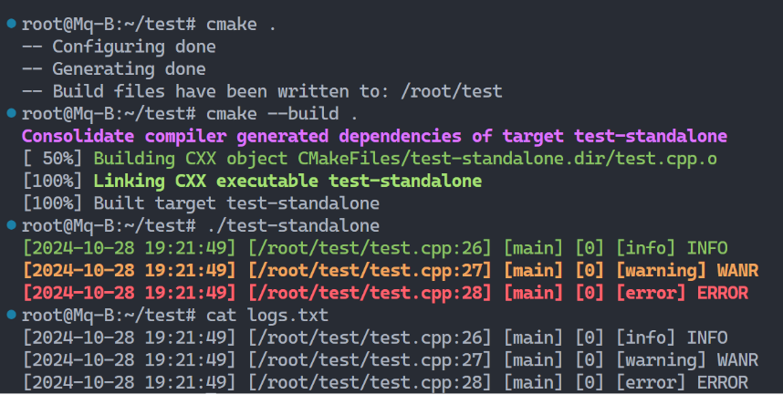

# C++ 包管理，编译构建配置等问题

我们 C++ 程序员在开发中经常需要处理构建下载包与三方库的问题，我们以最常见的 Linux 发行版 Ubuntu 和 windows 为例，进行介绍。

## `which` & `Get-Command`

如果我们想要查找一些可以在终端直接使用的程序的路径，比如 `gcc`、`cmake`、`git` 这种，我们可以使用 `which` 命令查看，通常都是在 `/usr/bin/`：

```shell
root@Mq-B:/usr/local/include# which cmake
/usr/bin/cmake
```

如果是 windows，powershell 可以使用 `Get-Command`、`where.exe`：

```powershell
PS C:\Users\A1387> Get-Command cmake

CommandType     Name                                               Version    Source
-----------     ----                                               -------    ------
Application     cmake.exe                                          3.25.2.0   D:\CLion 2023.1.4\bin\cmake\win\x64\bin\cmake.exe

PS C:\Users\A1387> where.exe cmake
D:\CLion 2023.1.4\bin\cmake\win\x64\bin\cmake.exe
```

> CMD 终端直接使用 **`where`** 即可。powershell 终端要强调 `.exe` 是因为 where 这个名字被用作另一个东西的别名了。

## `make`

`make` 是一个自动化构建工具，通常与 Makefile 配合使用。Makefile 中定义了如何编译和链接程序的规则。通过运行 make 命令，make 命令会读取 Makefile，自动执行编译和链接的步骤。基本用法如下：

```shell
make              # 根据当前目录下的 Makefile 编译项目
make clean        # 清理编译生成的文件
make install      # 安装编译好的程序或库
```

- 优点：使用人群多，简单易用。

`make install` 通常将我们编译好的库安装到 `/usr/local/lib` 路径下，头文件则是：`/usr/local/include`。

当然，这个路径可以根据 makefile 的编写而自定义，我们说的是通常编译库的情况。

make 是 GNU 工具链中不可或缺的一环，在 Linux 平台中几乎必不可少，不过过于古老，现在可以考虑采用 [**`Ninja`**](https://ninja-build.org/)。

## `apt`

`apt` 是一个用于 Debian 和 Ubuntu 系列 Linux 发行版的包管理工具。它提供了简单的方法来安装、更新和删除软件包。基本用法包括：

```shell
sudo apt update              # 更新软件包列表
sudo apt install [package]   # 安装指定的软件包
sudo apt remove [package]    # 卸载指定的软件包
```

安装的库通常位于 `/usr/lib/x86_64-linux-gnu`，头文件位于 `/usr/include`。使用以下命令可以查看某个包的安装位置：

```shell
dpkg -L [package]
```

- 优点：apt 可以自动处理依赖关系，并且从官方源中安装软件相对安全和可靠。

使用 Ubuntu 系统，在开发当中几乎一定会使用它。

## `qmake`

`qmake` 是 Qt 默认的构建系统（Qt6 后默认 CMake），使用后缀为 `.pro` 的文件定义构建过程。它能够生成适用于不同构建系统的文件，包括 `Makefile` 和 `Ninja` 文件。

与 CMake 不同的是，qmake 在 Linux 和 Windows 平台上均默认生成 Makefile。在 Linux 中，可以直接使用 `make` 命令构建项目，而在 Windows 中，可以使用 **`nmake`**。

> `nmake` 是 msvc 工具链的一部分。如果你在使用 [MinGW](https://www.mingw-w64.org/) 工具链，则可以使用 GNU Make (**make**) 来构建项目

通常的操作步骤如下：

```shell
mkdir build       # 创建构建目录
cd build          # 进入构建目录
qmake ..          # 生成 Makefile
make              # 编译构建项目（Windows 可使用 nmake）
```

另外 window 下 Qt 官方的 IDE QtCreator 默认的构建工具是 [`jom`](https://wiki.qt.io/Jom)，而非 `nmake`。

## `msbuild`

`msbuild` 是 Microsoft 提供的构建工具，看到这个名字你或许很陌生，但是谈起 Visual Studio 的 `.sln` 解决方案文件和 `.vcxproj` 项目文件，你应该就会很熟悉了。

msbuild 是 Visual Studio 中的核心构建引擎，用于编译和打包各种类型的项目。我们平时在 Visual Studio 图形界面中进行的各种项目设置，都是写到那些配置文件中，**而当你点击绿色的运行按钮时，其实就是自动执行了我们的 msbuild 命令来构建我们的项目**。

```powershell
msbuild MyProject.vcxproj /p:Configuration=Release
```

```powershell
msbuild MyProject.sln /p:Configuration=Release
```

手动使用 `msbuild` 命令的好处在于，它能清晰地显示我们传递给编译器的编译链接选项。例如：

```powershell
PS D:\project\test_msbuild\test1> msbuild .\test1.sln
适用于 .NET Framework MSBuild 版本 17.11.2+c078802d4
生成启动时间为 2024/11/4 18:34:48。

节点 1 上的项目“D:\project\test_msbuild\test1\test1.sln”(默认目标)。
ValidateSolutionConfiguration:
  正在生成解决方案配置“Debug|x64”。
项目“D:\project\test_msbuild\test1\test1.sln”(1)正在节点 1 上生成“D:\project\test_msbuild\test1\test1.vcxproj”(2) (默认 目标)。
PrepareForBuild:
  正在创建目录“test1\x64\Debug\”。
  已启用结构化输出。编译器诊断的格式设置将反映错误层次结构。有关详细信息，请参阅 https://aka.ms/cpp/structured-output。
  正在创建目录“D:\project\test_msbuild\test1\x64\Debug\”。
  正在创建目录“test1\x64\Debug\test1.tlog\”。
InitializeBuildStatus:
  正在创建“test1\x64\Debug\test1.tlog\unsuccessfulbuild”，因为已指定“AlwaysCreate”。
  正在对“test1\x64\Debug\test1.tlog\unsuccessfulbuild”执行 Touch 任务。
VcpkgTripletSelection:
  Using triplet "x64-windows" from "D:\vcpkg-master\installed\x64-windows\"
  Using normalized configuration "Debug"
ClCompile:
  D:\visual studio 2022\VC\Tools\MSVC\14.41.34120\bin\HostX64\x64\CL.exe /c /I"D:\vcpkg-master\installed\x64-windows\in
  clude" /ZI /JMC /nologo /W3 /WX- /diagnostics:column /sdl /Od /D _DEBUG /D _CONSOLE /D _UNICODE /D UNICODE /Gm- /EHsc
   /RTC1 /MDd /GS /fp:precise /Zc:wchar_t /Zc:forScope /Zc:inline /permissive- /Fo"test1\x64\Debug\\" /Fd"test1\x64\Deb
  ug\vc143.pdb" /external:W3 /Gd /TP /FC /errorReport:queue /utf-8 test1.cpp
  test1.cpp
Link:
  D:\visual studio 2022\VC\Tools\MSVC\14.41.34120\bin\HostX64\x64\link.exe /ERRORREPORT:QUEUE /OUT:"D:\project\test_msb
  uild\test1\x64\Debug\test1.exe" /INCREMENTAL /ILK:"test1\x64\Debug\test1.ilk" /NOLOGO /LIBPATH:"D:\vcpkg-master\insta
  lled\x64-windows\debug\lib" /LIBPATH:"D:\vcpkg-master\installed\x64-windows\debug\lib\manual-link" kernel32.lib user3
  2.lib gdi32.lib winspool.lib comdlg32.lib advapi32.lib shell32.lib ole32.lib oleaut32.lib uuid.lib odbc32.lib odbccp3
  2.lib "D:\vcpkg-master\installed\x64-windows\debug\lib\*.lib" /MANIFEST /MANIFESTUAC:"level='asInvoker' uiAccess='fal
  se'" /manifest:embed /DEBUG /PDB:"D:\project\test_msbuild\test1\x64\Debug\test1.pdb" /SUBSYSTEM:CONSOLE /TLBID:1 /DYN
  AMICBASE /NXCOMPAT /IMPLIB:"D:\project\test_msbuild\test1\x64\Debug\test1.lib" /MACHINE:X64 test1\x64\Debug\test1.obj
  test1.vcxproj -> D:\project\test_msbuild\test1\x64\Debug\test1.exe
AppLocalFromInstalled:
  pwsh.exe -ExecutionPolicy Bypass -noprofile -File "D:\vcpkg-master\scripts\buildsystems\msbuild\applocal.ps1" "D:\pro
  ject\test_msbuild\test1\x64\Debug\test1.exe" "D:\vcpkg-master\installed\x64-windows\debug\bin" "test1\x64\Debug\test1
  .tlog\test1.write.1u.tlog" "test1\x64\Debug\vcpkg.applocal.log"
  'pwsh.exe' is not recognized as an internal or external command,
  operable program or batch file.
  命令“pwsh.exe -ExecutionPolicy Bypass -noprofile -File "D:\vcpkg-master\scripts\buildsystems\msbuild\applocal.ps1" "D:\
  project\test_msbuild\test1\x64\Debug\test1.exe" "D:\vcpkg-master\installed\x64-windows\debug\bin" "test1\x64\Debug\te
  st1.tlog\test1.write.1u.tlog" "test1\x64\Debug\vcpkg.applocal.log"”已退出，代码为 9009。
  "C:\Windows\System32\WindowsPowerShell\v1.0\powershell.exe" -ExecutionPolicy Bypass -noprofile -File "D:\vcpkg-master
  \scripts\buildsystems\msbuild\applocal.ps1" "D:\project\test_msbuild\test1\x64\Debug\test1.exe" "D:\vcpkg-master\inst
  alled\x64-windows\debug\bin" "test1\x64\Debug\test1.tlog\test1.write.1u.tlog" "test1\x64\Debug\vcpkg.applocal.log"
FinalizeBuildStatus:
  正在删除文件“test1\x64\Debug\test1.tlog\unsuccessfulbuild”。
  正在对“test1\x64\Debug\test1.tlog\test1.lastbuildstate”执行 Touch 任务。
已完成生成项目“D:\project\test_msbuild\test1\test1.vcxproj”(默认目标)的操作。

已完成生成项目“D:\project\test_msbuild\test1\test1.sln”(默认目标)的操作。


已成功生成。
    0 个警告
    0 个错误

已用时间 00:00:01.30
PS D:\project\test_msbuild\test1> cd .\x64\Debug\
PS D:\project\test_msbuild\test1\x64\Debug> .\test1.exe
Hello msbuild!
```

**`ClCompile`** 和 **`Link`** 阶段清晰地展示了我们传递给 `cl.exe` 的编译和链接参数

## `cmake`

`CMake` 是一个跨平台的自动化构建系统，它使用 `CMakeLists.txt` 文件来定义构建过程。CMake 可以生成 Makefile、msbuild、ninja 等各种其他构建系统所需的文件。基本用法如下：

```shell
mkdir build                # 创建构建目录
cd build                   # 进入构建目录
cmake ..                   # 配置项目，生成构建文件（Linux 下通常为 makefile，Windows 下通常为 msbuild）
cmake --build .            # 编译项目
cmake --install .          # 安装编译好的程序或库
```

使用 Makefile 的流程通常是：

```shell
mkdir build                # 创建构建目录
cd build                   # 进入构建目录
cmake ..                   # 生成 Makefile（只当 cmake 是生成 makefile 的工具）
make                       # 编译项目
make install               # 安装编译好的程序或库
```

- 优点：CMake 提供了跨平台支持，能够生成多种构建系统的文件，简化了项目的移植和构建过程。

- `cmake ..` 在 Linux 平台默认会生成 Makefile，make 是基于这些 Makefile 来进行构建的

这两种方法的最终目标都是构建和安装软件，`cmake --install` 提供了一种更通用的方法，因为它不依赖于具体的构建系统（Makefile、Ninja 等），而是直接通过 CMake 的安装机制来处理。

我们极其不推荐

### 强调

以上提到的 `/usr/lib/x86_64-linux-gnu`、`/usr/include`、`/usr/local/lib`、`/usr/local/include` 都是 Linux 系统默认的查找路径，理论上来说只需要添加链接选项，而库路径和 include 路径我们都可以**无需设置**，直接使用库。

假设你已经配置好 `spdlog` 并放入到查找目录，可以直接：

```shell
g++ -o my_logger my_logger.cpp -lspdlog
```

增加一个链接选项即可，qmake、cmake 都类似，无需额外设置 include 路径或库路径。

### CMake 的 `PackageConfig.cmake` 文件

绝大多数的 C++ 第三方库会提供 `PackageConfig.cmake` 文件（有时也称为 `<PackageName>Config.cmake`），这个文件的主要目的是简化库的查找和链接过程。使用这种文件有以下几个优点：

1. **自动查找**：当你在 `CMakeLists.txt` 中使用 `find_package(<PackageName> REQUIRED)` 时，CMake 会自动在标准路径下查找相应的配置文件。找到后，CMake 会设置相应的变量和目标，使得链接库和包含头文件变得更加简洁。

2. **简化配置**：一旦找到包，配置文件中定义的变量会提供库的路径、头文件的路径以及必要的依赖关系。你只需在项目中添加两行代码：

   ```cmake
   find_package(<PackageName> REQUIRED)
   target_link_libraries(${PROJECT_NAME} PRIVATE <PackageName>::<PackageName>)
   ```

这样就能完成库的引入，无需手动设置路径。

比如 Qt 只需要两行 CMake 就能引入：

```cmake
find_package(Qt6 REQUIRED Widgets)
target_link_libraries(${PROJECT_NAME} PRIVATE Qt6::Widgets)
```

> 当然了，前提是你当前的设置能找到 Qt 的那些 PackageConfig.cmake 文件。 vs 的话安装 Qt 插件设置路径，就能直接如此。

### 使用 CMake 编译构建安装引入 `spdlog`

这实际很简单：

```shell
git clone https://github.com/gabime/spdlog.git
cd spdlog
mkdir build
cd build
cmake ..
cmake --build . --parallel
cmake --install .
```

> 默认构建为 Debug 产物，如果需要 Release，则在 build 改成：
>
>```shell
> cmake --build . --config Release --parallel
>```
>
> 如果是 windows，执行 install 会要求你有 Release 和 Debug 两个版本，Linux 系统无此问题。

最后的 install 的输出会显示我们的库被安装在哪，其实和 make install 没什么区别。

- 头文件：安装在 /usr/local/include/spdlog 目录下。
- 库文件：libspdlog.a 安装在 /usr/local/lib 目录。
- CMake 配置文件：安装在 /usr/local/lib/cmake/spdlog，方便其他项目通过 CMake 使用 spdlog。
- 包配置文件：spdlog.pc 安装在 /usr/local/lib/pkgconfig，供 pkg-config 使用。

而我们的要想在我们的项目引入这个库也非常的简单，只需要两行：

```cmake
find_package(spdlog REQUIRED)
target_link_libraries(${PROJECT_NAME} PRIVATE spdlog::spdlog_header_only)
```

另外，尤其是 windows，可能希望指明安装路径，这很简单：

```cmake
cmake .. -DCMAKE_INSTALL_PREFIX="C:\YourCustomInstallPath"
```

但是这样的话，库也就没安装在 cmake 默认会查找的路径了，如果想要设置全局，我们需要设置  **CMAKE_PREFIX_PATH**  环境变量。

cmake 就会去查找这个路径。

我们可以简单一些，直接在 cmake 文件中定义这个变量：

```cmake
set(CMAKE_PREFIX_PATH "C:/YourCustomInstallPath" CACHE STRING "自定义查找包的安装路径" FORCE)
```

然后另一个 cmake 文件包含它，如：

```cmake
include(CMakeVariables.cmake)
```

---

测试代码：

```cpp
#include <spdlog/spdlog.h>
#include <spdlog/sinks/stdout_color_sinks.h>
#include <spdlog/sinks/basic_file_sink.h>

inline void setupLogging() {
    auto file_sink = std::make_shared<spdlog::sinks::basic_file_sink_mt>("logs.txt");
    file_sink->set_level(spdlog::level::debug);
    file_sink->set_pattern("[%Y-%m-%d %H:%M:%S] [%@] [%!] [%O] [%l] %v");

    auto console_sink = std::make_shared<spdlog::sinks::stdout_color_sink_mt>();
    console_sink->set_level(spdlog::level::debug);
    console_sink->set_pattern("%^[%Y-%m-%d %H:%M:%S] [%@] [%!] [%O] [%l] %v%$");

    auto logger = std::make_shared<spdlog::logger>("multi_sink", spdlog::sinks_init_list{file_sink, console_sink});
    spdlog::register_logger(logger);

    spdlog::set_default_logger(logger);
}

#define LOG_INFO(msg) SPDLOG_LOGGER_INFO(spdlog::get("multi_sink"), msg)
#define LOG_WARN(msg) SPDLOG_LOGGER_WARN(spdlog::get("multi_sink"), msg)
#define LOG_ERROR(msg) SPDLOG_LOGGER_ERROR(spdlog::get("multi_sink"), msg)

int main() {
    setupLogging();
    LOG_INFO("INFO");
    LOG_WARN("WANR");
    LOG_ERROR("ERROR");
}
```

编译构建：

```shell
cmake .
cmake --build.
```



### 建议 windows 的 CMake 构建配置

由于 `cmake --install .` 默认放到 `C:\Program Files (x86)` 目录下，所以我们建议通常指明安装位置，定义我们的库存放的地方。

所有库都可以安装在那，也就是说我们 windows 建议 `spdlog` 的编译构建使用大概是：

```powershell
cmake .. -DCMAKE_INSTALL_PREFIX="D:\lib\spdlog"
cmake --build . --config Debug --parallel
cmake --build . --config Release --parallel
cmake --install .
```

然后 cmake 中定义一个变量即可，也就是：

```cmake
set(CMAKE_PREFIX_PATH "D:/lib" CACHE STRING "自定义查找包的安装路径" FORCE)
```

那么所有 `D:/lib` 路径下使用 cmake 管理的库，我们就都可以简单的两行代码引入了。

```cmake
find_package(SFML 2.6.1 COMPONENTS system window graphics audio network REQUIRED)
target_link_libraries(${PROJECT_NAME} PRIVATE sfml-system sfml-window sfml-graphics sfml-audio sfml-network)

find_package(fmt CONFIG REQUIRED)
target_link_libraries(${PROJECT_NAME} PRIVATE fmt::fmt-header-only)

find_package(spdlog REQUIRED)
target_link_libraries(${PROJECT_NAME} PRIVATE spdlog::spdlog_header_only)
```

```powershell
PS D:\lib> ls


    Directory: D:\lib


Mode                 LastWriteTime         Length Name
----                 -------------         ------ ----
d-----         2024/9/28     12:02                fmt_x64-windows
d-----         2024/9/20     18:30                SFML-2.6.1-windows-vc17-64-bit
d-----         2024/11/1     18:30                spdlog
```

## `Ninja`

[Ninja](https://ninja-build.org/) 是一个小型构建系统，专注于速度。它与其他构建系统的主要区别在于两个方面：它旨在由更高层次的构建系统生成输入文件，并且旨在尽可能快速地执行构建。Ninja构建文件是人类可读的，但不是特别方便手写。Ninja 通常被嵌入到功能更加强大的构建系统当中，如 CMake，可以由 CMake 生成 Ninja。

我们还是以 spdlog 项目的构建为例，我们可以使用 `-G` 选项指明生成 Ninja 文件：

```shell
PS D:\project\spdlog\build> cmake .. -G Ninja
-- The CXX compiler identification is Clang 18.1.3 with GNU-like command-line
-- Detecting CXX compiler ABI info
-- Detecting CXX compiler ABI info - done
-- Check for working CXX compiler: D:/LLVM/bin/clang++.exe - skipped
-- Detecting CXX compile features
-- Detecting CXX compile features - done
-- Build spdlog: 1.14.1
-- Performing Test CMAKE_HAVE_LIBC_PTHREAD
-- Performing Test CMAKE_HAVE_LIBC_PTHREAD - Failed
-- Looking for pthread_create in pthreads
-- Looking for pthread_create in pthreads - not found
-- Looking for pthread_create in pthread
-- Looking for pthread_create in pthread - not found
-- Check if compiler accepts -pthread
-- Check if compiler accepts -pthread - no
-- Found Threads: TRUE
-- Build type: Debug
-- Generating example(s)
-- Generating install
-- Configuring done
-- Generating done
-- Build files have been written to: D:/project/spdlog/build
```

我们可以选择直接输入 Ninja 进行编译构建，如同 Linux 平台 `cmake ..` 后直接 `make` 一样。

```shell
PS D:\project\spdlog\build> Ninja
[10/10] Linking CXX executable example\example.exe
```

默认是 Debug 模式。

> Ninja 本身无法直接选择 Debug 或 Release 构建类型，因为它是一个低级别的构建执行工具

```shell
cmake -G Ninja -DCMAKE_BUILD_TYPE=Release ..
```

然后再 Ninja 构建即可。

不过显然我们无需这样做，我们最好的做法是直接：

```shell
cmake .. -G Ninja
cmake --build . --config Debug --parallel
cmake -G Ninja -DCMAKE_BUILD_TYPE=Release ..
cmake --build . --config Release --parallel
```

没办法，必须多次运行 `cmake..` 生成需要的 Ninja 文件，这点比较特殊。
