# godbolt 使用文档

[**godbolt**](https://godbolt.org/) 是一个开源的 web 代码编译测试网站，可以帮助我们方便快速的进行代码的编译，可以选择众多的环境，更新快速，编译器版本众多。

godbolt 支持几乎市面上所有的编程语言，不过**本文档使用 C++ 进行使用讲解**。

## 打开 godbolt

每个人打开 godbolt 的布局样子可能完全不一样。

1. 如果你是第一次听说并且第一次打开这个网站，那么你的布局应该是固定的。
2. 如果你使用过，自己用过这个网站，自己设置了字体，或者其他布局，那么下次打开网站都是这样的。
3. 如果你打开过其他人分享给你的 godbolt 链接，**那么你的默认布局就会变成别人分享给你的样子**，自己重新打开 [**godbolt**](https://godbolt.org/) 刷新也是一样的。

所以我们先统一一下布局，以下是我分享的链接，直接打开即可：

```txt
https://godbolt.org/z/41eET6e5v
```

这样我们的布局就统一了：

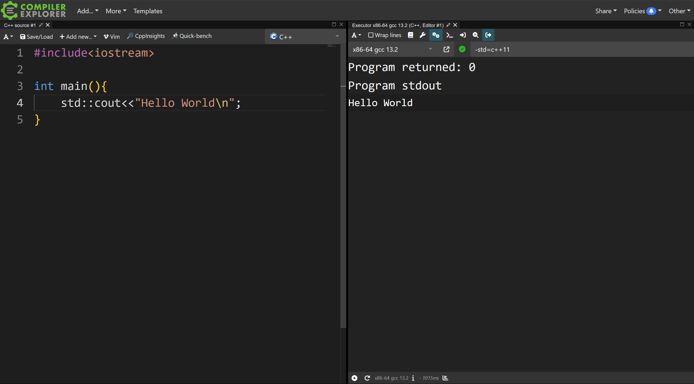

目前的布局只有两个东西:代码文件、编译器。

我们看到它成功编译并且输出了运行结果。

## 初级使用

我们直接将其全部删除，你自己重新创建，点击上方控件的❌：

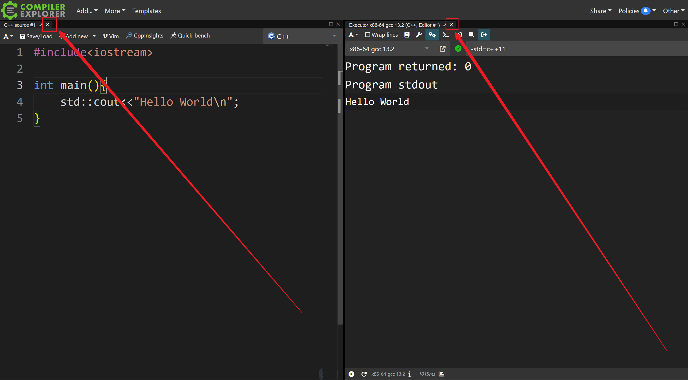

然后就变成：

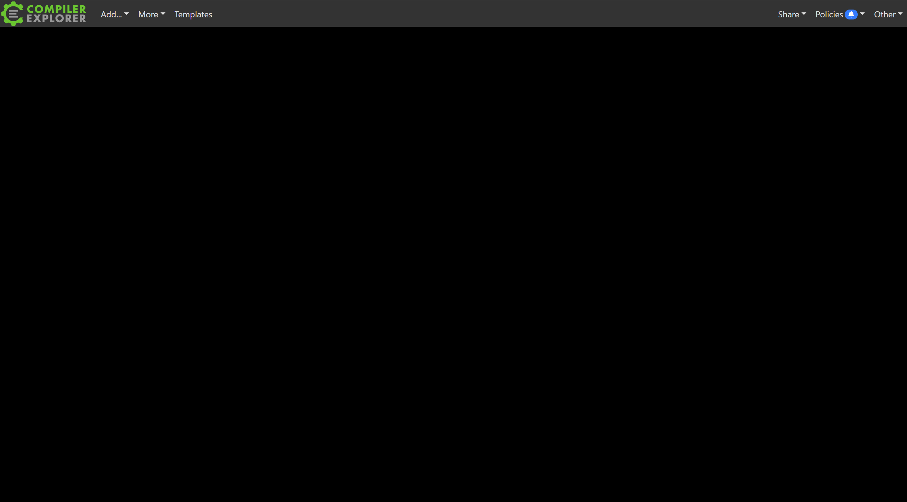

我们点击左上角的 **Add -> Source Editor** 得到了一个可以编辑的文本界面，可以放上自己的代码。

然后点击新建出来的这个代码编辑页的 **Add new -> Execution Only** 即可创建出一个执行单元，它与我们这个当前的文件关联，默认编译这个文件中的代码。

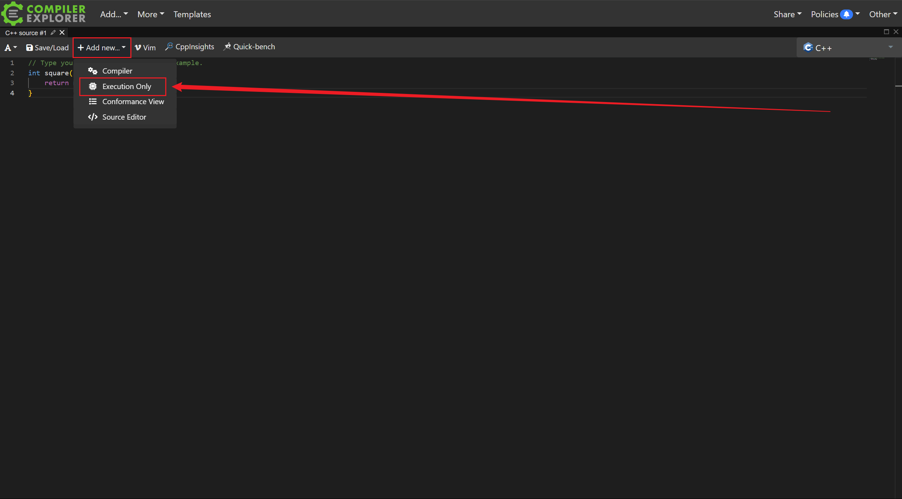

我们也可以控件的 `A` ，比如左上角那个，设置代码的字体大小，然后写好代码，一个最基础的编译测试，就做好了：

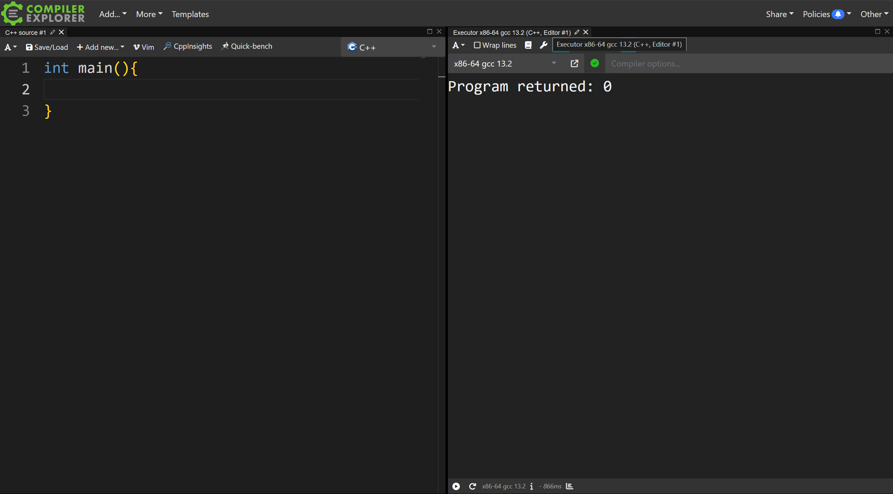

我们也可以选择别的编译器，或者增加一些别的编译选项：

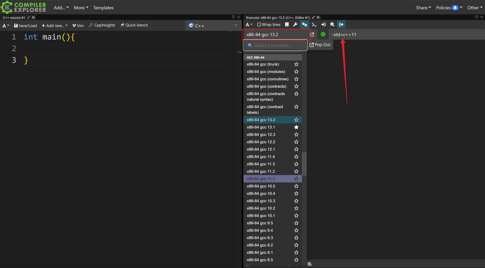

那么如何分享给其他人看呢？点击右上角的 **Share -> Short Link**：

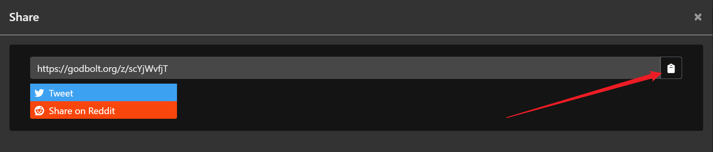

你就可以随意发送给其他人了

```txt
https://godbolt.org/z/scYjWvfjT
```

链接几乎是永久的，不用担心失效。

## 调整布局与主题设置

我们可以随意控制自己创建出的界面的字体大小和占据的位置：

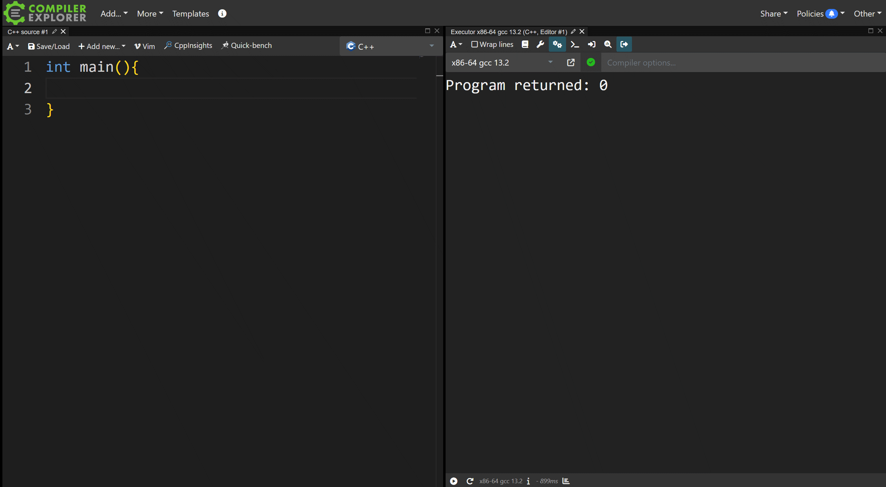

当然，我们也可以设置自己喜欢的主题：

最上方，**More -> Settings -> Site theme**


## 标准输入与命令行参数传递

```cpp
#include <iostream>

int main(){
    int n = 0;
    std::cin>> n;
    std::cout<< n <<'\n';
}
```

这样一段代码，如何让它在 godbolt 上运行并设置标准输入呢？很简单：

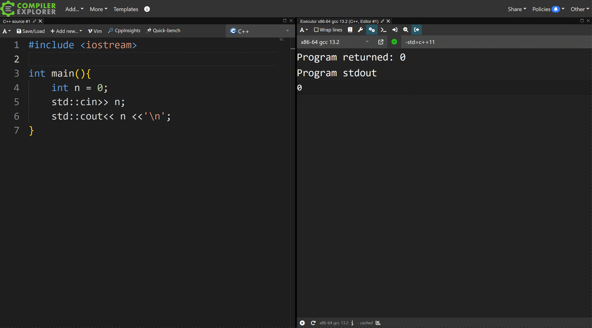

分享链接：

```txt
https://godbolt.org/z/66Knd31oq
```

---

```cpp
#include <iostream>

int main(int argc, char* argv[]) {
    for (int i = 1; i < argc; ++i) {
        std::cout << argv[i] << ' ';
    }
}
```

这样一段代码，我们如何通过 godbolt 传递给程序参数呢？很简单：

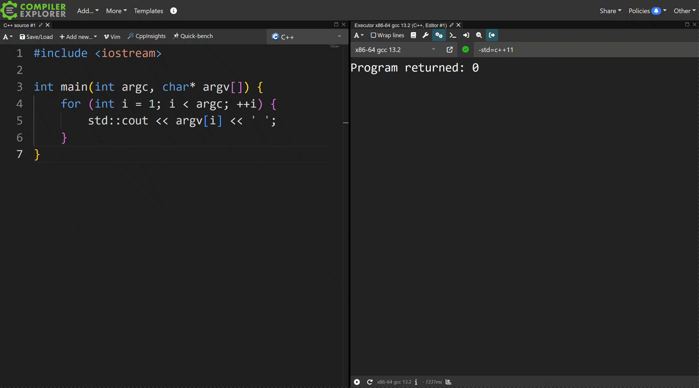

分享链接：

```txt
https://godbolt.org/z/P8jxh4M47
```

## 多文件以及多编译器测试展示

一个 godbolt 网页中可以有多个代码文件，乃至多个编译器测试运行结果。

一个代码文件对应多个编译器测试运行结果：

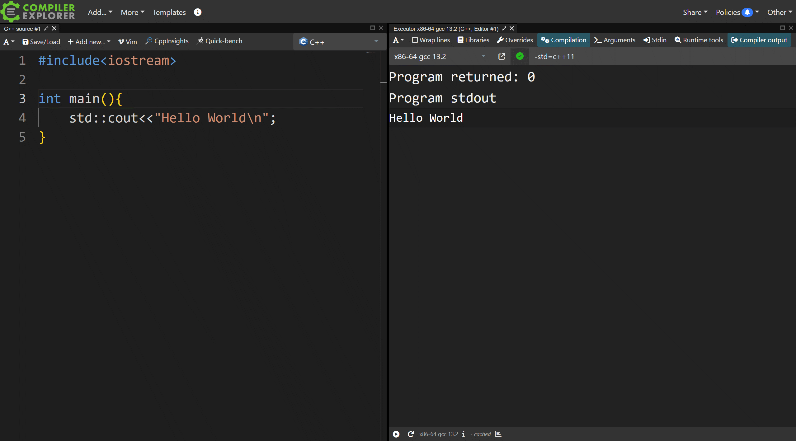

分享链接：

```txt
https://godbolt.org/z/sjeqdxKc7
```

如果要同时展示多段代码或者比较，那就按照之前的教程点击最左上角的 **Add -> Source Editor** 得到了一个可以编辑的文本界面，然后像上面一样 **Add new -> Execution Only** 即可创建出一个执行单元，设置编译器执行。

## 引入开源三方库

## CMake 项目模板

## Complier 控件的众多作用

## MSVC 的特殊性

## 总结
