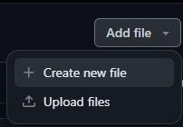

1. 如果之前没有 fork 仓库，请先 [Fork](https://github.com/Mq-b/Loser-HomeWork/fork) 仓库。
2. 前往**你的仓库**的对应文件夹下（如 `src/群友提交/第一题`），创建以你的名字命名的 `.cpp` 文件并提交。

3. 前往 [此处](https://github.com/Mq-b/Loser-HomeWork/compare)，单击 `compare across forks`，在 `head repository` 中选择你的仓库。单击 `Create pull request`，在 Title 一栏中填写相关信息后点击下方按钮完成。
